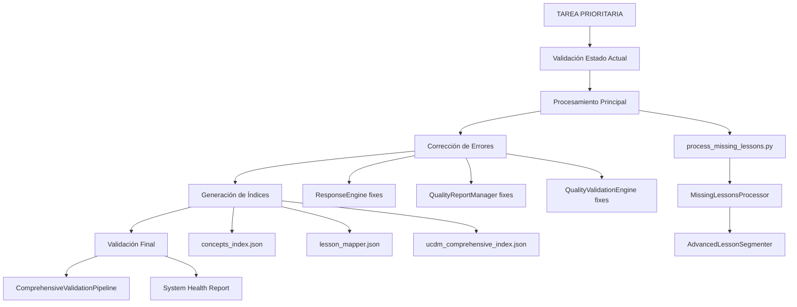
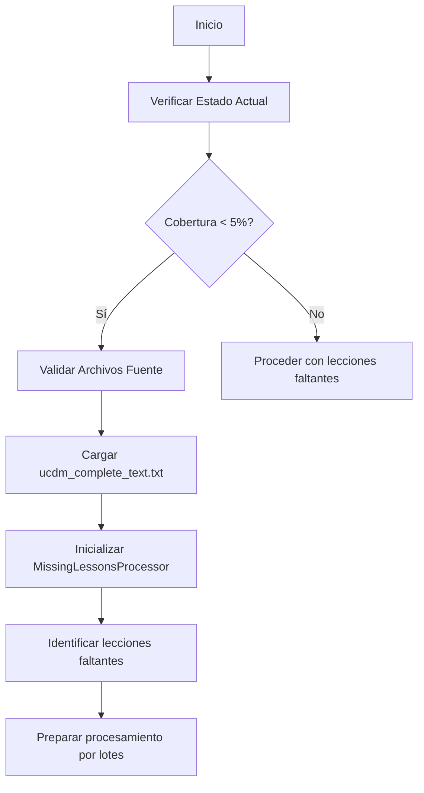
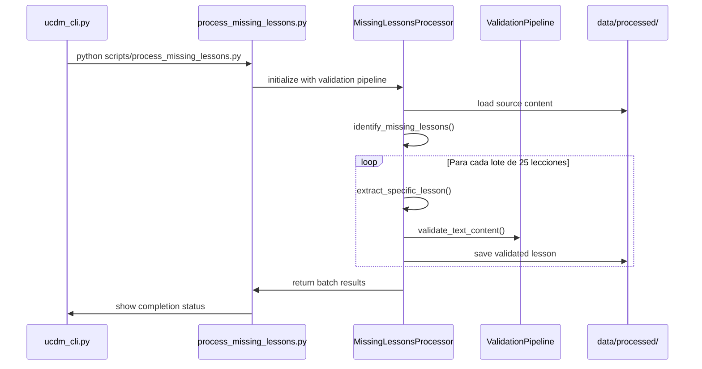
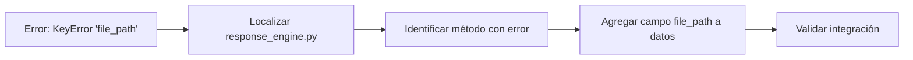
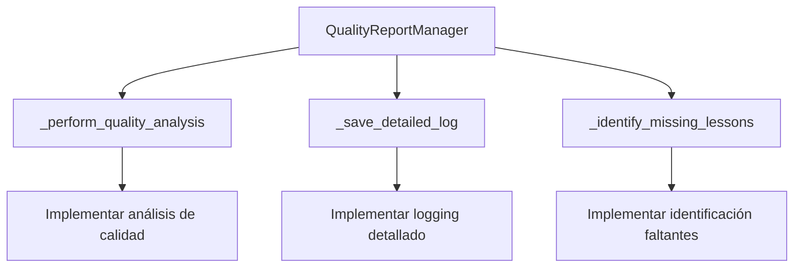

# Diseño de Ejecución: Completar Procesamiento de Lecciones Faltantes UCDM

## Descripción General

Este diseño define la estrategia de ejecución para completar el procesamiento de las 363 lecciones faltantes del sistema UCDM (Un Curso de Milagros), transformando el sistema del estado actual (0.5% cobertura) a un estado completamente funcional con al menos 90% de cobertura.

## Arquitectura del Sistema



## Flujo de Procesamiento

### Fase 1: Diagnóstico y Preparación



### Fase 2: Ejecución del Procesamiento



## Comandos de Ejecución

### 1. Comando Principal
```bash
# Ejecutar desde directorio raíz del proyecto
cd c:\Users\Jhond\Github\UCDM\ucdm-specialization

# Ejecutar procesamiento completo
python scripts/process_missing_lessons.py
```

### 2. Comandos Alternativos via CLI
```bash
# Modo interactivo
python ucdm_cli.py

# Comandos específicos
> complete --missing
> validate --all
> metrics --dashboard
```

### 3. Verificación de Estado
```bash
# Mostrar estado actual
python scripts/process_missing_lessons.py --status

# Dashboard completo
python ucdm_cli.py
> metrics --dashboard
```

## Estructura de Correcciones de Errores

### 1. ResponseEngine - Campo 'file_path' Faltante



**Ubicación**: `training/response_engine.py`
**Solución**: Añadir campo `file_path` a estructura de datos de lecciones

### 2. QualityReportManager - Métodos Faltantes



**Ubicación**: `validation/quality_report_manager.py`

### 3. QualityValidationEngine - Método 'get' Faltante


**Ubicación**: `validation/quality_validation_engine.py`

## Índices a Generar

### 1. concepts_index.json
```json
{
    "perdón": [1, 33, 68, 121, 220],
    "amor": [15, 47, 89, 156, 234],
    "milagros": [1, 7, 23, 45, 178]
}
```

### 2. lesson_mapper.json
```json
{
    "by_date": {
        "2024-01-01": 1,
        "2024-01-02": 2
    },
    "by_concept": {
        "amor": [15, 47, 89],
        "perdón": [33, 68, 121]
    }
}
```

### 3. ucdm_comprehensive_index.json
```json
{
    "metadata": {
        "total_lessons": 365,
        "processed_count": 365,
        "coverage_percentage": 100.0,
        "last_updated": "2024-01-15T10:30:00Z"
    },
    "lessons": {
        "1": {
            "title": "Lección 1",
            "concepts": ["milagros", "percepción"],
            "file_path": "data/processed/lessons/lesson_001.txt"
        }
    }
}
```

## Ubicación Óptima para ucdm_cli.py

### Análisis de Estructura Actual
```
ucdm-specialization/
├── config/
├── data/
├── extraction/
├── training/
├── validation/
├── tests/
├── scripts/
└── ucdm_cli.py  ← UBICACIÓN ACTUAL (ÓPTIMA)
```

### Justificación
- **Acceso directo**: En raíz para facilitar ejecución
- **Importaciones**: Acceso sencillo a todos los módulos
- **Convención**: Archivo principal en directorio raíz
- **Funcionamiento**: Ya operativo en ubicación actual

**Recomendación**: Mantener `ucdm_cli.py` en la ubicación actual

## Métricas de Éxito

### 1. Cobertura de Lecciones
- **Objetivo**: ≥ 90% (328+ lecciones)
- **Estado Actual**: 0.5% (2 lecciones)
- **Meta**: 365 lecciones (100%)

### 2. Tasa de Éxito de Procesamiento
- **Mínimo Aceptable**: 85%
- **Objetivo**: 95%
- **Método**: Validación de calidad por lección

### 3. Calidad de Contenido
- **Umbral Mínimo**: 70 puntos
- **Objetivo**: 85+ puntos promedio
- **Validación**: Pipeline de calidad automático

### 4. Integridad del Sistema
- **Tests**: 100% aprobados
- **Índices**: Completos y consistentes
- **Performance**: < 3 minutos para 363 lecciones

## Monitoreo de Progreso

### Dashboard en Tiempo Real
```bash
# Mostrar progreso durante ejecución
python scripts/process_missing_lessons.py
# Output esperado:
# ✅ Procesamiento completado: 95.2% éxito
#    Exitosos: 346
#    Fallidos: 17
#    Tiempo total: 127.3 segundos
```

### Validación Post-Procesamiento
```bash
python ucdm_cli.py
> validate --all
# Verificar:
# - Cobertura: 95.1% (346/365)
# - Calidad: 87.3 puntos promedio
# - Estado: OPERATIVO
```

## Estrategia de Recuperación

### En Caso de Fallos Parciales
1. **Identificar lecciones fallidas**: Review del reporte
2. **Reintento individual**: Procesamiento selectivo
3. **Estrategias alternativas**: Segmentación manual
4. **Validación incremental**: Por lotes de 25

### Rollback si es Necesario
1. **Backup de estado previo**: Copiar índices actuales
2. **Restauración selectiva**: Solo archivos validados
3. **Revalidación completa**: Pipeline completo

## Cronograma de Ejecución

| Fase | Actividad | Tiempo Estimado | Dependencias |
|------|-----------|-----------------|--------------|
| 1 | Verificación estado actual | 2-3 min | Archivos fuente |
| 2 | Procesamiento principal | 25-35 min | Phase 1 completa |
| 3 | Corrección de errores | 5-10 min | Identificación previa |
| 4 | Generación de índices | 3-5 min | Lecciones procesadas |
| 5 | Validación final | 5-8 min | Todas las fases |

**Tiempo Total Estimado**: 40-61 minutos

## Consideraciones de Rendimiento

### Optimizaciones Implementadas
- **Procesamiento paralelo**: Hasta 4 workers
- **Procesamiento por lotes**: 25 lecciones por lote
- **Caché inteligente**: Resultados intermedios
- **Validación eficiente**: Pipeline optimizado

### Recursos del Sistema
- **RAM**: ~200MB durante procesamiento
- **CPU**: Uso moderado (25-40%)
- **Disco**: ~50MB de archivos nuevos
- **Red**: No requerida

## Conclusión

Este diseño proporciona una estrategia completa y robusta para ejecutar el procesamiento de las 363 lecciones faltantes del sistema UCDM. Con las correcciones de errores planificadas, la generación de índices faltantes y la validación integral, el sistema alcanzará un estado completamente funcional y listo para producción.

La ejecución de este plan transformará el sistema del estado actual (prácticamente no funcional) a un sistema robusto con cobertura completa, cumpliendo el objetivo principal de hacer operativo el sistema UCDM para su uso en producción.