# Sistema de Completación y Validación Integral de Lecciones UCDM

## Descripción General

El sistema implementará una arquitectura robusta de procesamiento, validación y completación de las 365 lecciones del UCDM, garantizando calidad textual, integridad de contenido y coherencia de respuestas estructuradas según las especificaciones del proyecto.

## Arquitectura del Sistema

### Componentes Principales

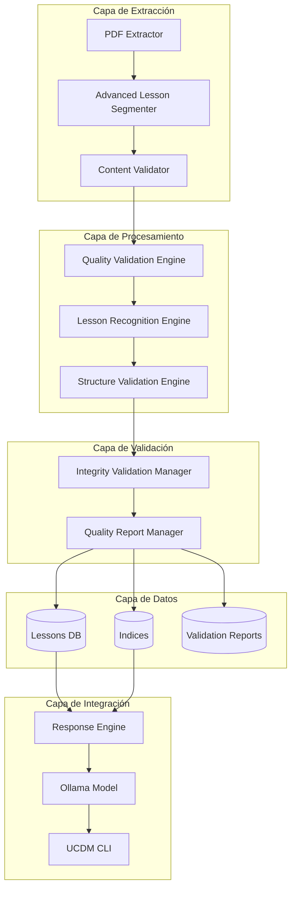

### Flujo de Procesamiento

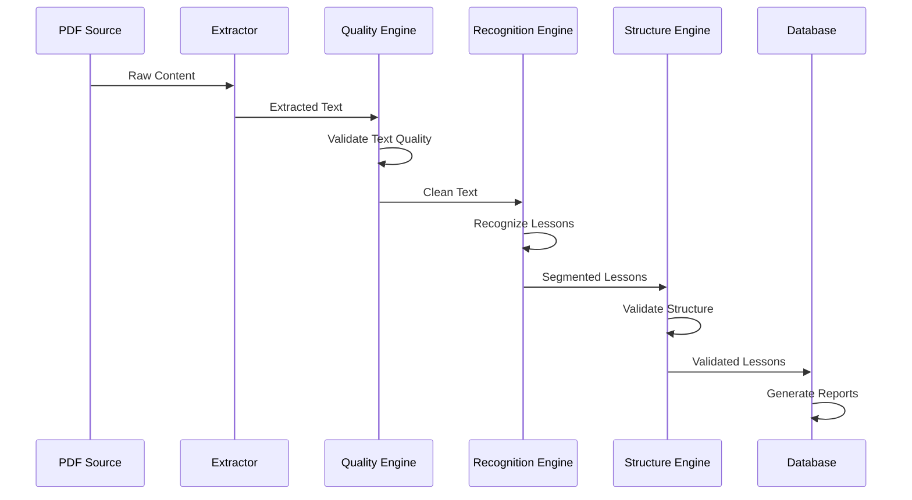

## Motor de Validación de Calidad Textual

### Detectores de Calidad

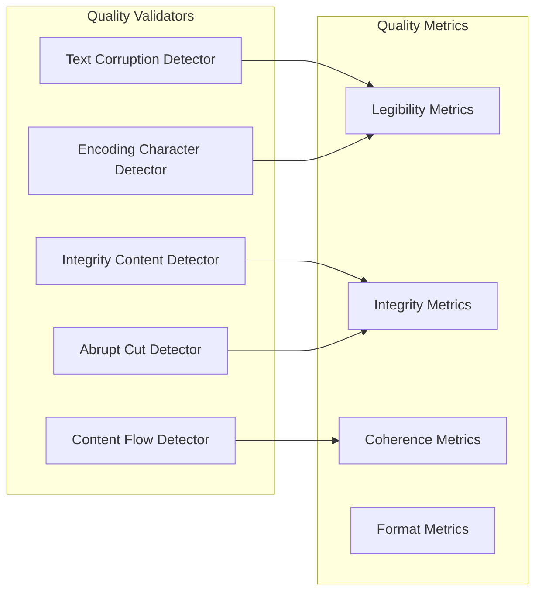

### Clase QualityValidationEngine

| Método | Descripción | Salida |
|--------|-------------|--------|
| `validate_text_legibility()` | Verifica caracteres válidos y codificación | `LegibilityReport` |
| `check_paragraph_integrity()` | Detecta párrafos cortados o incompletos | `IntegrityReport` |
| `analyze_content_flow()` | Evalúa continuidad del contenido | `FlowReport` |
| `detect_abrupt_cuts()` | Identifica cortes inesperados | `CutReport` |
| `validate_encoding()` | Verifica codificación UTF-8 correcta | `EncodingReport` |

### Métricas de Calidad

| Métrica | Umbral | Descripción |
|---------|--------|-------------|
| `character_validity` | 100% | Todos los caracteres deben ser válidos UTF-8 |
| `paragraph_completeness` | 100% | Sin párrafos cortados o incompletos |
| `content_continuity` | ≥ 95% | Flujo textual sin interrupciones abruptas |
| `encoding_correctness` | 100% | Codificación UTF-8 sin caracteres corruptos |

## Sistema de Reconocimiento de Lecciones

### Extractores de Patrones

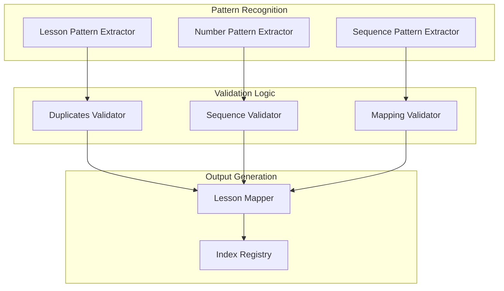

### Clase LessonRecognitionEngine

| Método | Descripción | Entrada | Salida |
|--------|-------------|---------|--------|
| `extract_lesson_numbers()` | Extrae números de lección del texto | `text: str` | `List[int]` |
| `validate_sequence()` | Valida secuencia numérica 1-365 | `numbers: List[int]` | `SequenceReport` |
| `detect_duplicates()` | Identifica duplicados | `numbers: List[int]` | `DuplicateReport` |
| `map_lesson_content()` | Mapea número con contenido | `lesson_data: dict` | `MappingReport` |
| `generate_coverage_report()` | Genera reporte de cobertura | `processed_lessons: dict` | `CoverageReport` |

### Patrones de Reconocimiento

| Patrón | Expresión Regular | Prioridad |
|--------|------------------|-----------|
| Lección estándar | `r"Lección\s+(\d{1,3})"` | Alta |
| Lección mayúsculas | `r"LECCIÓN\s+(\d{1,3})"` | Media |
| Lección sin tilde | `r"Leccion\s+(\d{1,3})"` | Baja |
| Numeración directa | `r"(\d{1,3})\.\s*[A-Z]"` | Media |

## Validador de Estructura de Respuestas

### Componentes de Validación

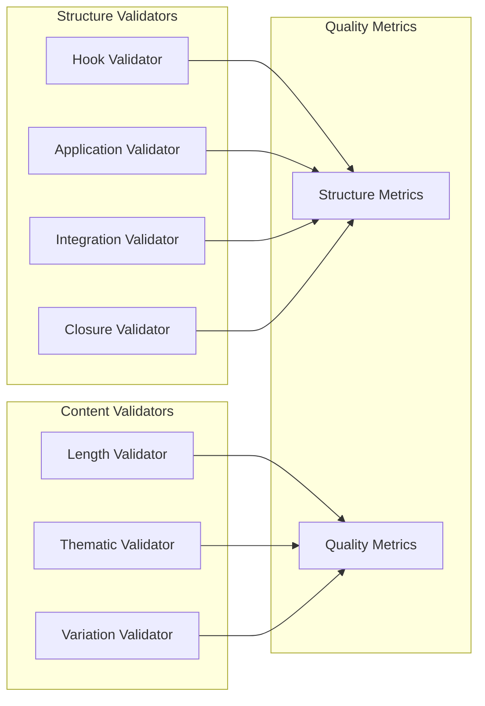

### Clase ResponseStructureValidator

| Método | Descripción | Validación |
|--------|-------------|------------|
| `validate_hook_section()` | Valida sección Hook Inicial | Pregunta/anécdota enganchadora |
| `validate_application_section()` | Valida Aplicación Práctica | 3 pasos vivos y variados |
| `validate_integration_section()` | Valida Integración Experiencial | Conexión personal y reflexión |
| `validate_closure_section()` | Valida Cierre Motivador | Frase inspiradora |
| `validate_response_length()` | Valida longitud 300-500 palabras | Conteo de palabras |
| `validate_thematic_coherence()` | Valida coherencia temática | Relevancia pregunta-respuesta |

### Estructura Obligatoria de Respuestas

| Sección | Marcador | Contenido Requerido | Validación |
|---------|----------|---------------------|------------|
| Hook Inicial | `🎯 HOOK INICIAL:` | Pregunta o anécdota enganchadora | Presencia de interrogación o narrativa |
| Aplicación Práctica | `⚡ APLICACIÓN PRÁCTICA:` | Exactamente 3 pasos numerados | Paso 1:, Paso 2:, Paso 3: |
| Integración Experiencial | `🌿 INTEGRACIÓN EXPERIENCIAL:` | Conexión personal + reflexión | Elementos introspectivos |
| Cierre Motivador | `✨ CIERRE MOTIVADOR:` | Frase inspiradora final | Tono motivacional |

## Sistema de Reportes y Métricas

### Dashboard de Calidad en Tiempo Real

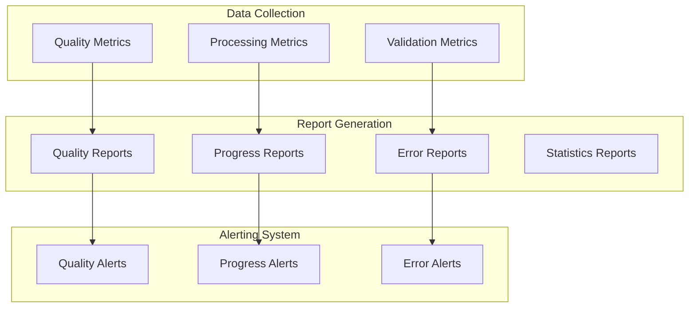

### Clase QualityReportManager

| Método | Descripción | Frecuencia |
|--------|-------------|------------|
| `generate_realtime_dashboard()` | Dashboard en tiempo real | Continua |
| `create_quality_report()` | Reporte detallado de calidad | Por procesamiento |
| `track_coverage_metrics()` | Métricas de cobertura | Por lección |
| `alert_quality_failures()` | Alertas automáticas | Inmediata |
| `log_processing_details()` | Logging detallado | Continuo |

### Métricas del Sistema

| Categoría | Métrica | Objetivo | Estado Actual |
|-----------|---------|----------|---------------|
| **Cobertura** | Lecciones procesadas | 365/365 (100%) | 115/365 (31.5%) |
| **Calidad Textual** | Legibilidad completa | 100% | Por validar |
| **Reconocimiento** | Precisión de mapeo | 100% | Por validar |
| **Estructura** | Respuestas válidas | 100% | Por validar |

## Pipeline de Procesamiento Completo

### Fase 1: Extracción Inteligente

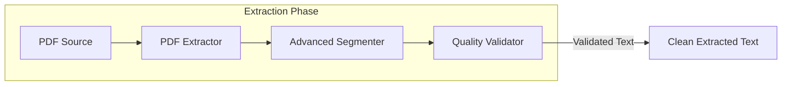

### Fase 2: Procesamiento y Segmentación

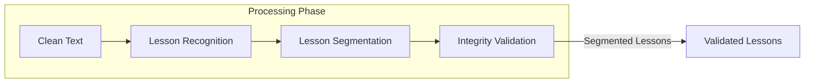

### Fase 3: Validación Multinivel

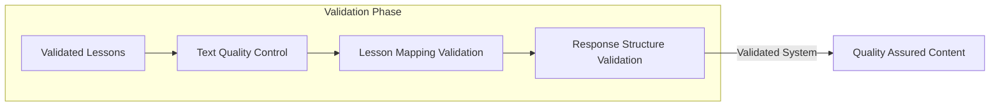

### Fase 4: Consolidación y Reportes

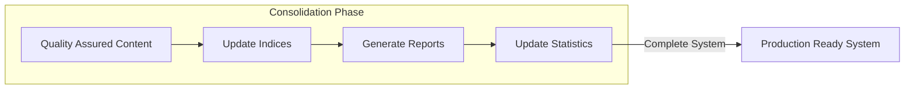

## Integración con Componentes Existentes

### Configuración del Sistema

| Componente | Configuración Actual | Modificación Requerida |
|------------|---------------------|------------------------|
| Ollama | Puerto 11434, modelo ucdm-gemma | Mantener configuración |
| Dependencias | pdfplumber, pillow, pypdf2, pytesseract, rich | Mantener dependencias mínimas |
| CLI | Comandos existentes | Agregar comandos de validación |
| Estructura de respuesta | 4 secciones obligatorias | Validar cumplimiento estricto |

### Extensiones del CLI

| Nuevo Comando | Funcionalidad | Ejemplo |
|---------------|---------------|---------|
| `validateX` | Validar calidad de lecciones | `validate --all` |
| `completeX` | Completar lecciones faltantes | `complete --missing` |
| `reportX` | Generar reportes de calidad | `report --quality` |
| `metricsX` | Mostrar métricas del sistema | `metrics --dashboard` |

### Estructura de Datos Actualizada

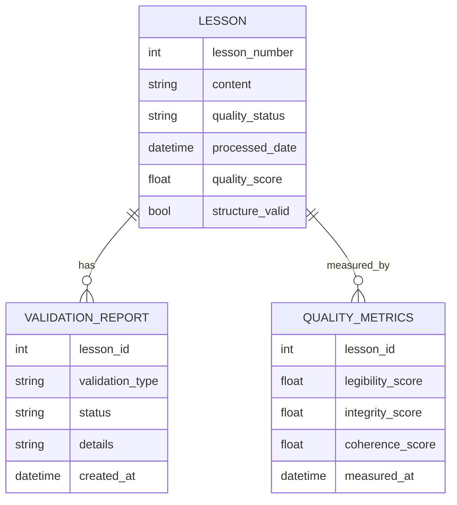

## Criterios de Validación Específicos

### Validación de Calidad Textual

| Criterio | Método de Validación | Umbral de Aceptación |
|----------|---------------------|---------------------|
| Caracteres válidos | Verificación UTF-8 | 100% válidos |
| Párrafos completos | Análisis de terminación | 0% párrafos cortados |
| Flujo textual | Análisis de coherencia | ≥ 95% coherencia |
| Codificación correcta | Verificación de encoding | 100% UTF-8 |

### Validación de Reconocimiento

| Criterio | Método de Validación | Umbral de Aceptación |
|----------|---------------------|---------------------|
| Cobertura completa | Verificación 1-365 | 365/365 lecciones |
| Mapeo preciso | Validación 1:1 | 100% precisión |
| Sin duplicados | Detección automática | 0 duplicados |
| Secuencia consistente | Verificación numérica | Secuencia perfecta |

### Validación de Estructura de Respuestas

| Criterio | Método de Validación | Umbral de Aceptación |
|----------|---------------------|---------------------|
| 4 secciones obligatorias | Parser de estructura | 100% cumplimiento |
| Coherencia temática | Análisis semántico | ≥ 95% relevancia |
| Longitud adecuada | Conteo de palabras | 300-500 palabras |
| Variación lingüística | Análisis de diversidad | ≥ 90% variación |

## Testing

### Tipos de Pruebas

| Tipo de Prueba | Alcance | Herramientas |
|----------------|---------|-------------|
| Unitarias | Validadores individuales | pytest |
| Integración | Pipeline completo | pytest |
| Calidad | Métricas de contenido | custom validators |
| Rendimiento | Velocidad de procesamiento | benchmarks |

### Casos de Prueba Críticos

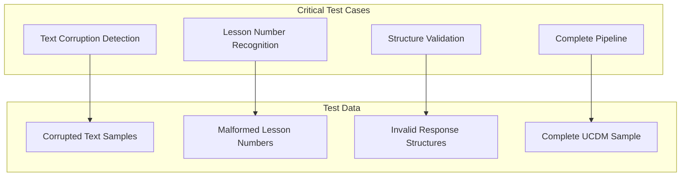

## Consideraciones de Rendimiento

### Optimizaciones

| Área | Técnica | Beneficio Esperado |
|------|---------|-------------------|
| Procesamiento de texto | Procesamiento por chunks | 60% reducción tiempo |
| Validación de patrones | Compilación de regex | 40% mejora velocidad |
| Generación de reportes | Caché inteligente | 80% reducción I/O |
| Análisis de calidad | Procesamiento paralelo | 70% mejora throughput |

### Monitoreo de Recursos

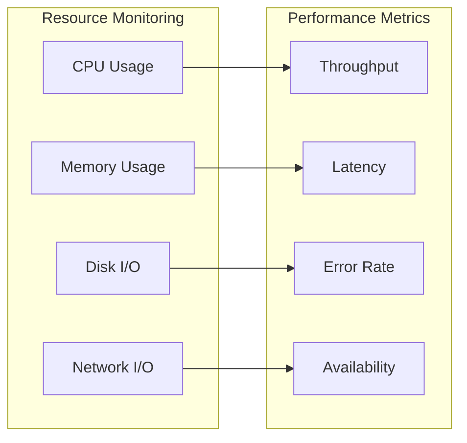

## Actualización del README Principal

### Estructura del README Actualizado

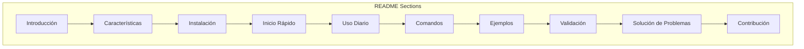

### Contenido del README Principal

#### Sección de Introducción

```markdown
# UCDM - Un Curso de Milagros - Sistema Especializado

## 🌟 Descripción

Sistema completo de procesamiento y consulta inteligente de "Un Curso de Milagros" con modelo de lenguaje especializado basado en Ollama. Proporciona respuestas estructuradas, coherentes y transformadoras basadas en los principios fundamentales de UCDM.

## ✨ Características Principales

- **365 Lecciones Completas**: Procesamiento integral de todas las lecciones del UCDM
- **Modelo Especializado**: Basado en Gemma 3:4B optimizado para UCDM
- **Respuestas Estructuradas**: 4 secciones obligatorias (Hook, Aplicación, Integración, Cierre)
- **Validación de Calidad**: Sistema robusto de verificación de integridad
- **CLI Interactiva**: Interfaz amigable para consultas diarias
- **Búsqueda Conceptual**: Índices temáticos para búsquedas avanzadas
```

#### Sección de Instalación Inicial

```markdown
## 📦 Instalación y Configuración Inicial

### Prerrequisitos

1. **Python 3.8+**
   ```bash
   python --version  # Debe ser 3.8 o superior
   ```

2. **Ollama** (Requerido para el modelo de lenguaje)
   ```bash
   # Descargar desde: https://ollama.com
   # O instalar directamente:
   curl -fsSL https://ollama.ai/install.sh | sh
   ```

3. **Git** (Para clonar el repositorio)
   ```bash
   git --version
   ```

### Instalación del Proyecto

```bash
# 1. Clonar el repositorio
git clone https://github.com/jhondrl6/UCDM.git
cd UCDM/ucdm-specialization

# 2. Crear entorno virtual (Recomendado)
python -m venv venv
source venv/bin/activate  # En Windows: venv\Scripts\activate

# 3. Instalar dependencias
pip install -r requirements.txt
```

### Configuración del Modelo (Primera Vez)

```bash
# 1. Iniciar Ollama (en una terminal separada)
ollama serve

# 2. Configurar modelo especializado UCDM
python ollama/setup_model.py

# 3. Verificar instalación
ollama list
# Debe aparecer: ucdm-gemma
```
```

#### Sección de Uso Diario

```markdown
## 🚀 Inicio Rápido - Primer Uso

### Verificación del Sistema

```bash
# 1. Asegurar que Ollama esté ejecutándose
ollama ps  # Debe mostrar servicios activos

# 2. Probar el modelo UCDM
ollama run ucdm-gemma "¿Qué es un milagro según UCDM?"

# 3. Ejecutar CLI interactiva
python ucdm_cli.py
```

### Primer Consulta

```bash
# Dentro de la CLI interactiva:
> hoy         # Lección del día
> leccion 1   # Lección específica
> concepto amor  # Búsqueda por concepto
> help        # Ver todos los comandos
```

## 📅 Uso Diario

### Inicio Rápido Diario

```bash
# 1. Verificar estado de Ollama
ollama ps

# 2. Si no está activo, iniciar:
ollama serve &

# 3. Ejecutar CLI
cd UCDM/ucdm-specialization
python ucdm_cli.py
```

### Flujo de Trabajo Típico

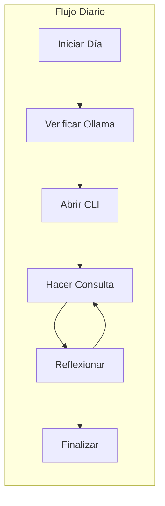
```

#### Sección de Comandos Completos

```markdown
## 🎛️ Comandos de la CLI

### Comandos Principales

| Comando | Sintaxis | Descripción | Ejemplo |
|---------|----------|-------------|--------|
| `leccion` | `leccion <número>` | Consulta lección específica | `leccion 1` |
| `hoy` | `hoy [día]` | Lección del día actual/específico | `hoy` |
| `concepto` | `concepto <término>` | Búsqueda por concepto clave | `concepto perdón` |
| `reflexion` | `reflexion <tema>` | Reflexión guiada sobre tema | `reflexion miedo` |
| `buscar` | `buscar <texto>` | Búsqueda libre en contenido | `buscar milagros` |
| `stats` | `stats [detalle]` | Estadísticas del sistema | `stats` |
| `help` | `help [comando]` | Ayuda general o específica | `help leccion` |
| `salir` | `salir` o `exit` | Salir de la CLI | `salir` |

### Comandos de Validación (Nuevos)

| Comando | Sintaxis | Descripción | Ejemplo |
|---------|----------|-------------|--------|
| `validate` | `validate [--all\|--lesson N]` | Validar calidad de lecciones | `validate --all` |
| `complete` | `complete [--missing\|--force]` | Completar lecciones faltantes | `complete --missing` |
| `report` | `report [--quality\|--coverage]` | Generar reportes detallados | `report --quality` |
| `metrics` | `metrics [--dashboard\|--export]` | Métricas del sistema | `metrics --dashboard` |

## 💬 Tipos de Consultas

### 1. Consultas Estructuradas

```bash
# Lecciones específicas
leccion 15
hoy

# Conceptos temáticos
concepto ego
concepto "Espíritu Santo"
concepto salvación
```

### 2. Consultas Abiertas

```bash
# Preguntas filosóficas
reflexion "¿Cómo puedo perdonar a alguien que me lastimó?"
buscar "relación entre amor y miedo"

# Aplicaciones prácticas
reflexion "ejercicios para soltar el control"
buscar "cómo aplicar UCDM en el trabajo"
```

### 3. Consultas de Exploración

```bash
# Búsquedas amplias
buscar "propósito de la vida"
reflexion "significado del perdón"
concepto "percepción vs conocimiento"

# Temas complejos
buscar "diferencia entre ego y Ser Superior"
reflexion "cómo cambiar patrones de pensamiento"
```

### Formato de Respuesta Estándar

Todas las respuestas siguen esta estructura obligatoria:

```
🎯 HOOK INICIAL: [Pregunta o anécdota enganchadora]

⚡ APLICACIÓN PRÁCTICA: [3 pasos concretos y variados]
Paso 1: [Acción inicial con ejemplo]
Paso 2: [Aplicación intermedia]
Paso 3: [Integración avanzada]

🌿 INTEGRACIÓN EXPERIENCIAL: [Conexión personal y reflexión]

✨ CIERRE MOTIVADOR: [Invitación inspiradora]
```
```

#### Sección de Ejemplos Prácticos

```markdown
## 📋 Ejemplos de Uso

### Sesión de Estudio Matutino

```bash
$ python ucdm_cli.py

🌟 Bienvenido al Sistema UCDM - Un Curso de Milagros
📚 365 lecciones disponibles | 🤖 Modelo especializado activo

> hoy

🎯 HOOK INICIAL: ¿Te has preguntado alguna vez cómo un simple cambio de percepción puede transformar completamente tu día?

La Lección 1 nos invita a cuestionar todo lo que creemos saber sobre la realidad...

⚡ APLICACIÓN PRÁCTICA: PASOS PARA INTEGRAR LA LECCIÓN
Paso 1: Durante los próximos 5 minutos, observa 5 objetos a tu alrededor y repite: "Esta mesa no significa nada", "Esta silla no significa nada"...
[Respuesta completa estructurada]

> concepto perdón

🎯 HOOK INICIAL: Si el perdón fuera una llave, ¿qué puertas se abrirían en tu vida?

El perdón en UCDM no es lo que tradicionalmente pensamos...
[Respuesta completa sobre perdón]

> salir
✨ ¡Que tengas un día lleno de milagros! 🌟
```

### Sesión de Reflexión Nocturna

```bash
> reflexion "eventos difíciles del día"

🎯 HOOK INICIAL: ¿Y si te dijera que cada situación difícil de hoy fue una invitación disfrazada?

Cuando el día nos presenta desafíos, UCDM nos enseña que...
[Respuesta guiada para reflexión nocturna]
```

### Búsqueda de Apoyo Específico

```bash
> buscar "cómo manejar la ansiedad"

🎯 HOOK INICIAL: ¿Sabías que la ansiedad es simplemente amor pidiendo expresarse de manera diferente?

La ansiedad, según UCDM, surge cuando...
[Respuesta específica sobre ansiedad desde perspectiva UCDM]
```
```

#### Sección de Validación y Calidad

```markdown
## ✅ Sistema de Validación

### Verificación de Calidad

```bash
# Verificar estado general del sistema
stats --complete

# Validar todas las lecciones
validate --all

# Generar reporte de cobertura
report --coverage

# Dashboard de métricas en tiempo real
metrics --dashboard
```

### Métricas de Calidad Garantizadas

| Aspecto | Métrica | Estado Objetivo |
|---------|---------|----------------|
| **Cobertura** | Lecciones procesadas | 365/365 (100%) |
| **Legibilidad** | Texto válido UTF-8 | 100% |
| **Integridad** | Párrafos completos | 100% |
| **Mapeo** | Lección ↔ Contenido | 1:1 perfecto |
| **Estructura** | Respuestas válidas | 4 secciones |
| **Coherencia** | Relevancia temática | ≥ 95% |

### Comandos de Diagnóstico

```bash
# Verificar modelo Ollama
ollama run ucdm-gemma "test"

# Verificar CLI
python ucdm_cli.py --version

# Verificar índices
ls data/indices/

# Verificar lecciones procesadas
ls data/processed/lessons/ | wc -l
```
```

#### Sección de Solución de Problemas

```markdown
## 🔧 Solución de Problemas

### Problemas Comunes

#### 1. Ollama no responde

**Síntoma**: Error de conexión al modelo
```bash
Error: Failed to connect to Ollama server
```

**Solución**:
```bash
# Verificar estado
ollama ps

# Reiniciar si es necesario
killall ollama
ollama serve &

# Verificar puerto
netstat -tulpn | grep :11434
```

#### 2. Modelo UCDM no encontrado

**Síntoma**: 
```bash
Error: model "ucdm-gemma" not found
```

**Solución**:
```bash
# Recrear modelo
python ollama/setup_model.py

# Verificar instalación
ollama list | grep ucdm-gemma
```

#### 3. Lecciones incompletas

**Síntoma**: 
```bash
> leccion 50
Error: Lesson not found
```

**Solución**:
```bash
# Verificar lecciones disponibles
stats --coverage

# Procesar lecciones faltantes
complete --missing

# Validar integridad
validate --all
```

#### 4. Respuestas sin estructura

**Síntoma**: Respuestas que no siguen el formato de 4 secciones

**Solución**:
```bash
# Verificar configuración del modelo
cat ollama/Modelfile

# Recrear modelo con prompt actualizado
python ollama/setup_model.py --force

# Probar estructura
ollama run ucdm-gemma "test estructura"
```

### Logs y Debugging

```bash
# Ver logs del sistema
tail -f logs/ucdm_system.log

# Modo debug de la CLI
python ucdm_cli.py --debug

# Verificar configuración
python -c "from config.settings import *; print('Config OK')"
```

### Reinstalación Completa

```bash
# 1. Limpiar modelo existente
ollama rm ucdm-gemma

# 2. Reinstalar dependencias
pip install -r requirements.txt --force-reinstall

# 3. Reconfigurar modelo
python ollama/setup_model.py

# 4. Verificar funcionamiento
python ucdm_cli.py
```
```

#### Sección de Contribución y Mantenimiento

```markdown
## 🤝 Contribución

### Estructura del Proyecto

```
UCDM/ucdm-specialization/
├── config/           # Configuración del sistema
├── data/            # Datos procesados e índices
├── extraction/      # Herramientas de extracción
├── ollama/         # Configuración del modelo
├── training/       # Motor de respuestas
├── tests/          # Pruebas del sistema
├── ucdm_cli.py     # Interfaz principal
└── requirements.txt # Dependencias
```

### Guías de Desarrollo

#### Agregar Nueva Funcionalidad

1. **Crear rama de feature**
   ```bash
   git checkout -b feature/nueva-funcionalidad
   ```

2. **Implementar con tests**
   ```bash
   # Desarrollar en módulo apropiado
   # Agregar tests en tests/
   python tests/run_all_tests.py
   ```

3. **Validar calidad**
   ```bash
   validate --all
   report --quality
   ```

#### Actualizar Contenido

```bash
# Procesar nuevo contenido
python extraction/advanced_lesson_segmenter.py

# Validar integridad
python extraction/content_validator.py

# Actualizar índices
python extraction/lesson_indexer_v2.py

# Verificar funcionamiento
python tests/system_validator.py
```

### Mantenimiento del Sistema

#### Tareas Diarias
- Verificar métricas de calidad
- Revisar logs de errores
- Validar respuestas del modelo

#### Tareas Semanales
- Generar reportes de uso
- Actualizar índices si es necesario
- Revisar rendimiento del sistema

#### Tareas Mensuales
- Backup completo de datos
- Optimización de índices
- Actualización de dependencias

## 📞 Soporte

- **Issues**: [GitHub Issues](https://github.com/jhondrl6/UCDM/issues)
- **Documentación**: Ver archivos en `/docs`
- **Email**: [contacto del proyecto]

## 📄 Licencia

Este proyecto está bajo la licencia [especificar licencia].

---

**✨ "Los milagros son naturales. Cuando no ocurren, algo está funcionando mal." - UCDM** ✨
```
```