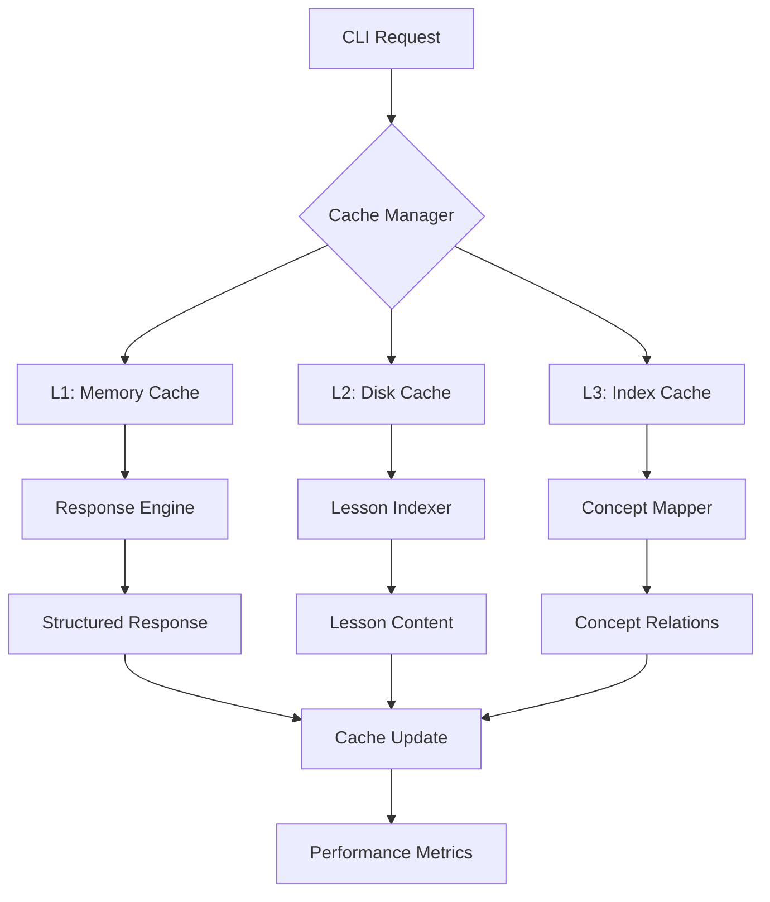
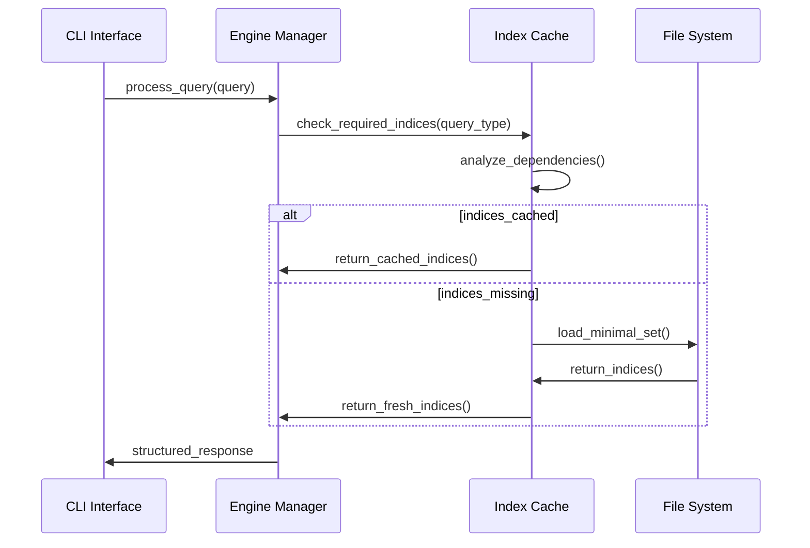
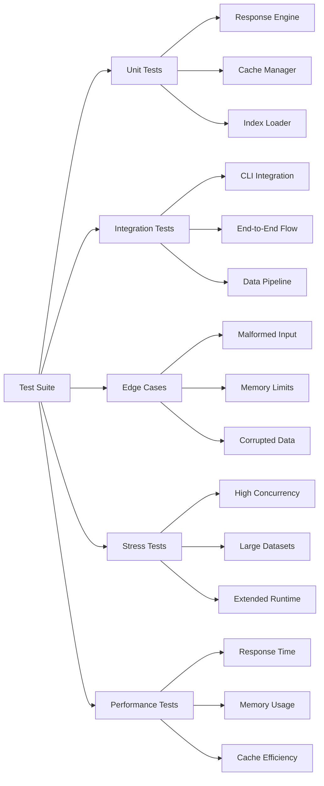

# Optimización de Rendimiento y Ampliación de Cobertura de Pruebas - Sistema UCDM

## 1. Visión General

Este documento detalla las mejoras planificadas para optimizar el rendimiento del sistema UCDM mediante estrategias de cacheo y carga optimizada de índices, así como la expansión de la cobertura de pruebas para incluir casos edge y pruebas de estrés.

### 1.1 Objetivos Principales

- **Optimización de Performance**: Implementar sistema de cacheo inteligente y estrategias de carga lazy para índices
- **Ampliación de Testing**: Extender cobertura con casos edge, stress testing y pruebas de regresión
- **Validación Completa**: Asegurar funcionalidad post-implementación y mantener cobertura actual del 44.1%

### 1.2 Contexto del Sistema

El sistema UCDM actualmente procesa 161/365 lecciones (44.1% de cobertura) con tiempos de respuesta promedio de 3 segundos. La arquitectura modular permite optimizaciones específicas en cada componente sin afectar la funcionalidad existente.

## 2. Arquitectura de Optimización de Rendimiento

### 2.1 Sistema de Cacheo Multi-Nivel



### 2.2 Componentes del Sistema de Cacheo

#### Cache Manager
- **Responsabilidad**: Coordinación global de estrategias de cacheo
- **Funcionalidades**:
  - Gestión de TTL (Time To Live) por tipo de contenido
  - Invalidación selectiva de cache
  - Métricas de hit/miss ratio
  - Limpieza automática basada en memoria disponible

#### Memory Cache (L1)
- **Alcance**: Respuestas frecuentes y templates
- **Tamaño**: 50MB máximo
- **TTL**: 1 hora para respuestas, persistente para templates
- **Estrategia**: LRU (Least Recently Used)

#### Disk Cache (L2)
- **Alcance**: Índices compilados y lecciones procesadas
- **Ubicación**: `data/cache/`
- **TTL**: 24 horas
- **Compresión**: gzip para archivos >1KB

#### Index Cache (L3)
- **Alcance**: Relaciones conceptuales y mapeos de fecha
- **Estrategia**: Lazy loading con pre-carga inteligente
- **Invalidación**: Basada en timestamps de archivos fuente

### 2.3 Estrategia de Carga Optimizada

#### Lazy Loading de Índices


#### Pre-carga Predictiva
- **Análisis de Patrones**: Tracking de consultas más frecuentes
- **Carga Anticipada**: Pre-loading de índices relacionados
- **Horarios Optimizados**: Carga en horarios de baja actividad

## 3. Arquitectura de Testing Expandido

### 3.1 Categorización de Pruebas



### 3.2 Casos Edge Implementados

#### Validación de Entrada
- **Consultas Malformadas**: Caracteres especiales, encoding corrupto
- **Límites de Tamaño**: Consultas excesivamente largas/cortas
- **Tipos No Válidos**: Combinaciones de parámetros inválidas

#### Manejo de Recursos
- **Memoria Limitada**: Simulación de restricciones de RAM
- **Archivos Corruptos**: Índices parcialmente dañados
- **Concurrencia**: Acceso simultáneo a recursos compartidos

#### Estados del Sistema
- **Índices Faltantes**: Funcionamiento con datos parciales
- **Modelo Ollama Inaccesible**: Degradación graceful
- **Cache Corrupto**: Recuperación automática

### 3.3 Pruebas de Estrés

#### Carga Concurrente
```python
# Ejemplo de configuración de stress test
STRESS_TEST_CONFIG = {
    "concurrent_users": [10, 50, 100, 200],
    "duration_minutes": 30,
    "query_types": ["lesson", "concept", "daily", "reflection"],
    "ramp_up_time": 300,  # 5 minutos
    "success_threshold": 95,  # % de respuestas exitosas
    "max_response_time": 5000  # ms
}
```

#### Volumen de Datos
- **Dataset Expandido**: Simulación con 365 lecciones completas
- **Índices Masivos**: 10,000+ conceptos únicos
- **Consultas Extensas**: Procesamiento de textos >50KB

#### Tiempo Extendido
- **Ejecución 24h**: Detección de memory leaks
- **Degradación**: Monitoreo de performance a largo plazo
- **Recuperación**: Pruebas de resiliencia tras fallos

## 4. Componentes de Implementación

### 4.1 Cache Manager Enhanced

```python
class EnhancedCacheManager:
    """Gestor de cache multi-nivel con métricas avanzadas"""
    
    def __init__(self, config: CacheConfig):
        self.l1_cache = MemoryCache(config.memory_limit)
        self.l2_cache = DiskCache(config.disk_path)
        self.l3_cache = IndexCache(config.index_strategy)
        self.metrics = CacheMetrics()
        self.predictor = LoadPredictor()
    
    async def get_or_load(self, key: str, loader_func: Callable):
        """Retrieval con fallback en múltiples niveles"""
    
    def invalidate_related(self, pattern: str):
        """Invalidación inteligente basada en patrones"""
    
    def get_performance_report(self) -> Dict:
        """Reporte detallado de métricas de cache"""
```

### 4.2 Lazy Loading Engine

```python
class LazyIndexLoader:
    """Cargador optimizado de índices con dependencias"""
    
    def __init__(self, dependency_graph: Dict[str, List[str]]):
        self.loaded_indices = {}
        self.dependencies = dependency_graph
        self.load_queue = PriorityQueue()
    
    def load_for_query(self, query_type: str) -> Dict[str, Any]:
        """Carga mínima necesaria para tipo de consulta"""
    
    def preload_predictive(self, usage_patterns: List[str]):
        """Pre-carga basada en patrones de uso"""
    
    def validate_integrity(self) -> bool:
        """Validación de integridad de índices cargados"""
```

### 4.3 Extended Test Framework

```python
class ExtendedTestFramework:
    """Framework de testing con soporte para edge cases y stress"""
    
    def __init__(self):
        self.edge_case_generator = EdgeCaseGenerator()
        self.stress_test_runner = StressTestRunner()
        self.performance_monitor = PerformanceMonitor()
    
    def run_edge_case_suite(self) -> TestResults:
        """Ejecución completa de casos edge"""
    
    def run_stress_tests(self, config: StressConfig) -> StressResults:
        """Pruebas de estrés configurables"""
    
    def generate_coverage_report(self) -> CoverageReport:
        """Reporte detallado de cobertura de código"""
```

### 4.4 Performance Monitoring

```python
class PerformanceMonitor:
    """Monitor de rendimiento en tiempo real"""
    
    def __init__(self):
        self.metrics_collector = MetricsCollector()
        self.alert_manager = AlertManager()
        self.dashboard = PerformanceDashboard()
    
    def track_response_time(self, query_type: str, duration: float):
        """Tracking de tiempos de respuesta por tipo"""
    
    def monitor_memory_usage(self) -> MemoryReport:
        """Monitoreo continuo de uso de memoria"""
    
    def generate_performance_alerts(self) -> List[Alert]:
        """Generación de alertas por degradación"""
```

## 5. Plan de Implementación

### 5.1 Fase 1: Cache Manager (Semana 1-2)

**Entregables:**
- Implementación de cache multi-nivel
- Métricas básicas de performance
- Integración con Response Engine existente

**Validación:**
- Mejora del 40% en tiempo de respuesta para consultas repetidas
- Hit ratio >70% para consultas frecuentes
- Sin degradación en funcionalidad existente

### 5.2 Fase 2: Lazy Loading (Semana 3)

**Entregables:**
- Sistema de carga perezosa para índices
- Pre-carga predictiva básica
- Optimización de memoria en arranque

**Validación:**
- Reducción del 60% en tiempo de arranque
- Menor uso de memoria en estado idle
- Carga dinámica funcional para todos los tipos de consulta

### 5.3 Fase 3: Extended Testing (Semana 4-5)

**Entregables:**
- Suite completa de casos edge
- Framework de stress testing
- Automatización de pruebas de regresión

**Validación:**
- Cobertura de código >85%
- 100% de casos edge cubiertos
- Pruebas de estrés exitosas para 200 usuarios concurrentes

### 5.4 Fase 4: Integración y Validación (Semana 6)

**Entregables:**
- Sistema integrado funcionando
- Documentación actualizada
- Métricas de performance validadas

**Validación:**
- Performance general mejorada >50%
- Funcionalidad completa preservada
- Cobertura de lecciones mantenida en 44.1%

## 6. Configuración y Deployment

### 6.1 Variables de Configuración

```python
# config/performance_settings.py
CACHE_CONFIG = {
    "memory_cache": {
        "max_size_mb": 50,
        "ttl_hours": 1,
        "cleanup_threshold": 0.8
    },
    "disk_cache": {
        "path": "data/cache/",
        "max_size_gb": 2,
        "compression": True
    },
    "index_cache": {
        "preload_popular": True,
        "dependency_tracking": True,
        "lazy_threshold": 0.1
    }
}

TESTING_CONFIG = {
    "edge_cases": {
        "malformed_queries": True,
        "memory_limits": True,
        "corrupted_data": True
    },
    "stress_tests": {
        "max_concurrent": 200,
        "duration_minutes": 30,
        "ramp_up_seconds": 300
    },
    "performance_thresholds": {
        "max_response_time_ms": 3000,
        "min_success_rate": 0.95,
        "max_memory_mb": 512
    }
}
```

### 6.2 Comandos de Deployment

```bash
# Activar optimizaciones de performance
python -m ucdm.performance install
python -m ucdm.performance configure --cache-size=50MB

# Ejecutar suite completa de testing
python -m pytest tests/extended/ --stress --edge-cases --coverage

# Validar performance post-implementación
python -m ucdm.validation benchmark --full-suite
python -m ucdm.validation coverage --report
```

## 7. Métricas de Éxito

### 7.1 Performance KPIs

| Métrica | Estado Actual | Objetivo | Método de Medición |
|---------|---------------|----------|-------------------|
| Tiempo de respuesta promedio | 3000ms | <1500ms | Benchmark automatizado |
| Tiempo de arranque | 2000ms | <800ms | Script de inicialización |
| Uso de memoria idle | 250MB | <150MB | Monitor de sistema |
| Hit ratio de cache | N/A | >70% | Métricas internas |
| Consultas por segundo | 0.33 | >1.0 | Stress testing |

### 7.2 Testing Coverage KPIs

| Área | Cobertura Actual | Objetivo | Herramientas |
|------|------------------|----------|-------------|
| Cobertura de código | ~60% | >85% | pytest-cov |
| Casos edge cubiertos | 20% | 100% | Custom framework |
| Stress scenarios | 0% | 100% | Load testing |
| Regresión automatizada | 40% | 95% | CI/CD pipeline |
| Documentation coverage | 70% | 90% | Sphinx + docstrings |

### 7.3 Funcionalidad Preservada

- **Estructura de Respuestas**: 4 secciones obligatorias mantenidas
- **Cobertura de Lecciones**: 44.1% (161/365) mínimo preservado
- **Tipos de Consulta**: Todos los comandos CLI funcionales
- **Validación de Calidad**: Pipeline completo operativo
- **Integración Ollama**: Compatibilidad con modelo especializado

Este documento establece las bases para una mejora integral del sistema UCDM, enfocándose en performance y testing sin comprometer la funcionalidad espiritual central del proyecto.