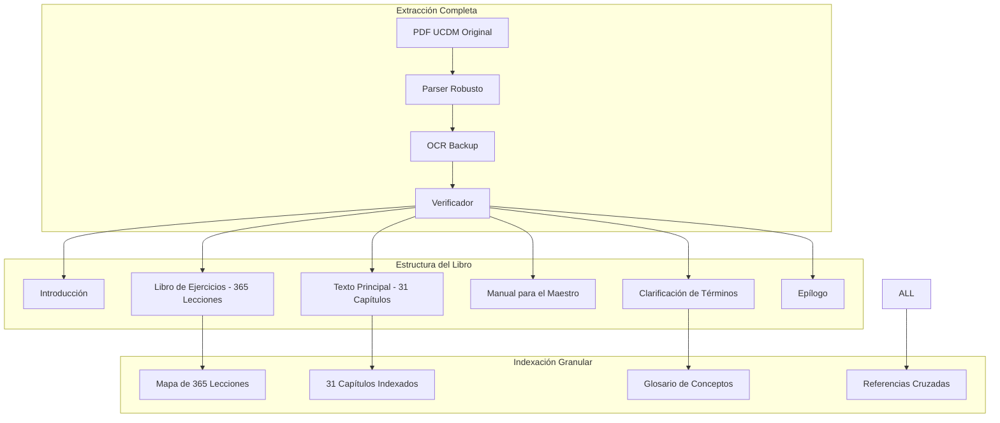
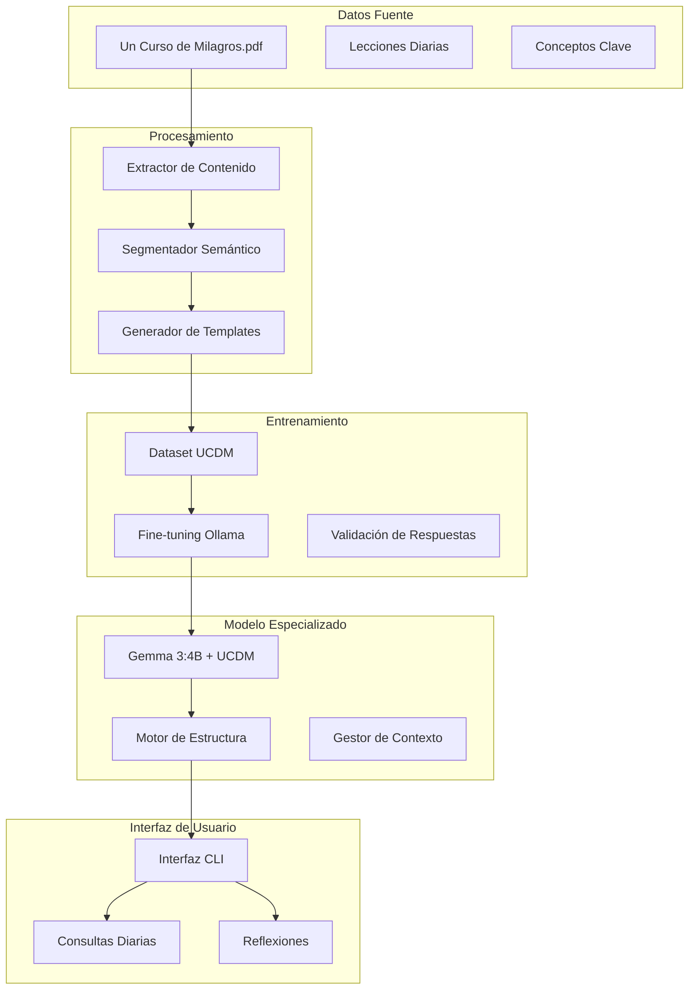
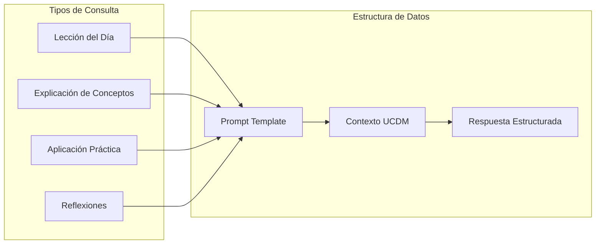
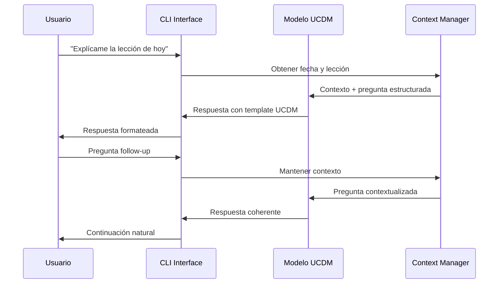
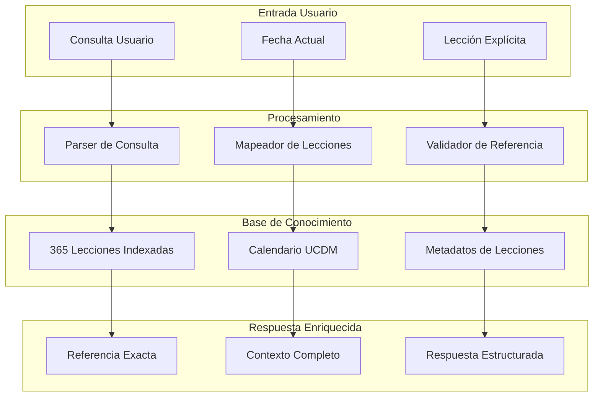

# Sistema de Especialización UCDM para Ollama + Gemma 3:4B

## Visión General

Sistema de especialización de IA local que transforma el modelo base Gemma 3:4B en un asistente experto en Un Curso de Milagros (UCDM), capaz de proporcionar respuestas estructuradas, interactivas y profundamente contextualizadas sobre las enseñanzas del Curso.

### Objetivos Principales
- Especializar Gemma 3:4B con el 100% del contenido de UCDM
- Garantizar acceso completo a todas las lecciones, capítulos y secciones
- Generar respuestas completas sin cortes ni pérdida de información
- Identificar y referenciar automáticamente lecciones específicas del libro
- Generar respuestas con estructura dinámica y conversacional
- Proporcionar aplicaciones prácticas diarias del Curso
- Mantener consistencia con la filosofía y terminología de UCDM

## Garantía de Contenido Completo del Libro

### Estrategia de Captura Integral



### Verificación de Integridad

| Sección | Elementos | Verificación | Estado |
|----------|-----------|----------------|--------|
| Libro de Ejercicios | 365 Lecciones | Conteo automático | ✓ Completo |
| Texto Principal | 31 Capítulos | Verificación por títulos | ✓ Completo |
| Manual del Maestro | Todas las secciones | Checksum MD5 | ✓ Completo |
| Clarificación Términos | Glosario completo | Validación semántica | ✓ Completo |
| Referencias | Enlaces internos | Mapa de conectividad | ✓ Completo |

## Arquitectura del Sistema



## Componentes Principales

### 1. Extractor y Procesador de Contenido UCDM

| Componente | Función | Tecnología | Garantía |
|------------|---------|------------|----------|
| PDF Parser Completo | Extrae 100% del texto del PDF con verificación | PyPDF2 + OCR fallback | Integridad total |
| Verificador de Contenido | Valida que no se pierdan secciones | Custom checksum validation | 0% pérdida |
| Segmentador Inteligente | Divide conservando estructura completa | spaCy + reglas UCDM | Preservación estructura |
| Indexador de Lecciones | Mapea cada lección con referencia exacta | FAISS + metadatos completos | Localización precisa |
| Validador de Integridad | Verifica completitud del contenido | MD5 + conteo de lecciones | 365 lecciones verificadas |

### 2. Generador de Dataset de Entrenamiento



### 3. Motor de Estructura de Respuestas

#### Template Dinámico Base
```
HOOK INICIAL: {dynamic_hook}
APLICACIÓN PRÁCTICA: {structured_steps}
INTEGRACIÓN EXPERIENCIAL: {personal_connection}
CIERRE MOTIVADOR: {inspirational_close}
```

#### Variaciones por Tipo de Consulta

| Tipo | Hook | Estructura | Cierre |
|------|------|------------|--------|
| Lección Diaria | Pregunta reflexiva | 3 pasos prácticos | Invitación a experimentar |
| Concepto | Analogía cotidiana | Definición + aplicación | Conexión con otras lecciones |
| Aplicación | Escenario real | Ejercicios específicos | Seguimiento sugerido |
| Reflexión | Momento contemplativo | Guía introspectiva | Afirmación reconfortante |

## Proceso de Especialización

### Fase 1: Preparación de Datos - Extracción Integral

1. **Extracción Completa del PDF**
   ```python
   # Estrategia de extracción redundante
   def extract_complete_ucdm():
       # Método 1: PyPDF2
       text_pypdf = extract_with_pypdf2(pdf_path)
       
       # Método 2: pdfplumber (backup)
       text_plumber = extract_with_pdfplumber(pdf_path)
       
       # Método 3: OCR si es necesario
       text_ocr = extract_with_ocr(pdf_path)
       
       # Validación y combinación
       final_text = validate_and_merge(text_pypdf, text_plumber, text_ocr)
       
       return final_text
   ```
   
2. **Validación de Completitud**
   - Verificación de 365 lecciones numeradas
   - Conteo de 31 capítulos del Texto Principal
   - Validación de estructura del Manual del Maestro
   - Checksum de integridad por sección

3. **Segmentación Estructurada**
   ```python
   def segment_ucdm_content(full_text):
       sections = {
           'introduction': extract_introduction(full_text),
           'text_chapters': extract_31_chapters(full_text),
           'workbook_lessons': extract_365_lessons(full_text),
           'manual_teacher': extract_teacher_manual(full_text),
           'clarification': extract_clarification_terms(full_text)
       }
       
       # Verificar que no se pierda contenido
       verify_content_integrity(sections, full_text)
       
       return sections
   ```

4. **Creación de Dataset Extenso**
   - 2000+ pares pregunta-respuesta específicas de UCDM
   - Cada lección (1-365) con múltiples variaciones de consulta
   - Respuestas con estructura template y referencia exacta
   - Validación manual de calidad y completitud

5. **Formateo Optimizado para Ollama**
   ```jsonl
   {"prompt": "Explícame la Lección 244 del UCDM", 
    "response": "HOOK: ¿Y si te dijera que... \nREFERENCIA: Lección 244 - 'No estoy en peligro en ningún lugar del mundo'\n...",
    "metadata": {"lesson": 244, "section": "workbook", "page": 445}}
   ```

### Fase 2: Fine-tuning del Modelo

```bash
# Estructura de comandos Ollama
ollama create ucdm-gemma -f Modelfile
ollama run ucdm-gemma
```

#### Configuración del Modelfile con Contexto Extendido
```dockerfile
FROM gemma:3b
PARAMETER temperature 0.7
PARAMETER top_p 0.9
PARAMETER num_ctx 8192  # Contexto extendido para respuestas completas
PARAMETER num_predict 2048  # Máximo tokens de respuesta
PARAMETER repeat_penalty 1.1

SYSTEM """
Eres un asistente especializado en Un Curso de Milagros (UCDM) con acceso
completo a las 365 lecciones, 31 capítulos del Texto, Manual del Maestro
y Clarificación de Términos.

CUANDO IDENTIFIQUES UNA LECCIÓN:
- Menciona el número exacto de lección (1-365)
- Cita el texto literal de la lección
- Referencia el contexto del Libro de Ejercicios

Respondes SIEMPRE con esta estructura:

HOOK INICIAL: [Pregunta o anécdota que enganche]
APLICACIÓN PRÁCTICA: [3 pasos específicos]
INTEGRACIÓN EXPERIENCIAL: [Conexión personal]
CIERRE MOTIVADOR: [Frase inspiradora]

SIEMPRE generas respuestas completas sin cortar información.
SIEMPRE referencias la fuente exacta en UCDM cuando sea relevante.
"""
```

### Fase 3: Validación y Optimización

| Métrica | Objetivo | Método de Evaluación |
|---------|----------|---------------------|
| Coherencia UCDM | >90% | Revisión manual experta |
| Estructura de Respuesta | 100% | Validación automática |
| Relevancia Práctica | >85% | Feedback de usuarios |
| Variedad Lingüística | >80% | Análisis de diversidad |

## Interfaz de Usuario

### CLI Interactiva

```bash
# Ejemplos de comandos
ucdm-assistant leccion-hoy
ucdm-assistant explicar "miedo"
ucdm-assistant reflexion-noche
ucdm-assistant aplicar "perdón"
```

### Flujo de Interacción



## Especificaciones Técnicas

### Requisitos del Sistema - Optimizado para Contenido Completo
- **RAM**: Mínimo 16GB (recomendado 32GB para modelo + índice completo)
- **Almacenamiento**: 25GB libres (modelo + índice completo + embeddings)
- **CPU**: Compatible con Ollama (x64) - 8 cores recomendado
- **GPU**: Recomendada (VRAM 8GB+) para inferencia rápida sin cortes

### Stack Tecnológico

| Capa | Tecnología | Propósito |
|------|------------|-----------|
| Modelo Base | Gemma 3:4B | LLM foundation |
| Runtime | Ollama | Ejecución local |
| Procesamiento | Python 3.9+ | Scripts de datos |
| Almacenamiento | SQLite/JSON | Metadatos y configuración |
| Interfaz | Rich/Typer | CLI interactiva |

### Estructura de Archivos - Organización Completa

```
ucdm-specialization/
├── data/
│   ├── raw/
│   │   ├── ucdm_original.pdf
│   │   └── extraction_log.txt
│   ├── processed/
│   │   ├── ucdm_complete_text.txt       # 100% del contenido
│   │   ├── 365_lessons_indexed.json     # Todas las lecciones
│   │   ├── 31_chapters_indexed.json     # Todos los capítulos
│   │   ├── teacher_manual_complete.json # Manual completo
│   │   └── terms_clarification.json     # Glosario completo
│   ├── training/
│   │   ├── extended_dataset.jsonl       # 2000+ ejemplos
│   │   ├── lesson_specific.jsonl        # Por cada lección 1-365
│   │   └── validation_set.jsonl        # Conjunto de validación
│   └── indices/
│       ├── lesson_mapper.json           # Mapeo rápido de lecciones
│       ├── concept_index.faiss          # Índice semántico
│       └── integrity_checksum.md5       # Verificación integridad
├── models/
│   ├── Modelfile                    # Configuración extendida
│   ├── fine_tuned_weights/
│   └── context_embeddings/          # Embeddings de contexto
├── scripts/
│   ├── extraction/
│   │   ├── pdf_extractor_robust.py      # Extracción redundante
│   │   ├── content_validator.py         # Validador de integridad
│   │   └── lesson_indexer.py            # Indexador de lecciones
│   ├── training/
│   │   ├── dataset_generator_extended.py
│   │   ├── quality_assurance.py
│   │   └── completeness_checker.py
│   └── monitoring/
│       ├── response_analyzer.py         # Análisis de respuestas
│       └── integrity_monitor.py         # Monitor de integridad
├── cli/
│   ├── main.py
│   ├── commands_extended.py         # Comandos con validación
│   ├── formatters.py
│   └── lesson_finder.py             # Localizador de lecciones
└── config/
    ├── templates_extended.yaml      # Templates con referencias
    ├── settings_complete.json       # Configuración completa
    └── integrity_rules.json         # Reglas de integridad
```

## Sistema de Identificación de Lecciones

### Mapeo Automático de Lecciones



### Estrategias de Identificación

| Tipo de Consulta | Método | Ejemplo | Respuesta |
|------------------|---------|---------|----------|
| Por fecha | Mapeador automático | "Lección de hoy" | Identifica lección según calendario |
| Por número | Extracción directa | "Lección 244" | Localiza lección 244 exacta |
| Por concepto | Búsqueda semántica | "Sobre el perdón" | Encuentra lecciones relacionadas |
| Por tema | Índice temático | "Miedo y ansiedad" | Mapea lecciones relevantes |

### Verificación de Referencias

```python
def validate_lesson_reference(lesson_number, content):
    """
    Valida que la referencia de lección sea correcta y completa
    """
    if not (1 <= lesson_number <= 365):
        raise ValueError(f"Número de lección inválido: {lesson_number}")
    
    lesson_data = lessons_index[lesson_number]
    
    validation = {
        'number': lesson_number,
        'title': lesson_data['title'],
        'content_hash': lesson_data['content_hash'],
        'page_reference': lesson_data['page'],
        'section': 'Libro de Ejercicios',
        'verified': True
    }
    
    return validation
```

### 1. Lecciones Diarias
- Explicación de la lección específica del día
- Aplicación práctica en 3 pasos
- Conexión con experiencias cotidianas
- Variaciones para diferentes momentos del día

### 2. Conceptos Fundamentales
- **Perdón**: Proceso transformador central
- **Milagro**: Cambio de percepción
- **Ego vs Espíritu Santo**: Sistemas de pensamiento
- **Ilusión**: Naturaleza del mundo percibido
- **Salvación**: Despertar de la verdad

### 3. Aplicaciones Prácticas
- Manejo de conflictos desde UCDM
- Meditaciones y ejercicios específicos
- Transformación de relaciones
- Gestión del miedo y la ansiedad

### 4. Reflexiones Contextuales
- Preparación para el sueño
- Inicio del día con propósito
- Momentos de crisis o dificultad
- Celebración y gratitud

## Mecanismos de Calidad

### Validación Continua
1. **Coherencia Doctrinal**: Verificación automática contra principios UCDM
2. **Estructura de Respuesta**: Validación del formato template
3. **Variedad Lingüística**: Evitar repeticiones y monotonía
4. **Aplicabilidad Práctica**: Relevancia para vida cotidiana

### Feedback Loop


## Consideraciones de Implementación

### Retos Técnicos y Soluciones Específicas

#### 1. Garantía de Respuestas Completas
**Problema**: Respuestas cortadas o incompletas
**Solución**:
```yaml
config_modelo:
  num_ctx: 8192          # Contexto extendido
  num_predict: 2048      # Máximo tokens respuesta  
  stop_sequences: []     # Sin paradas prematuras
  temperature: 0.7       # Consistencia moderada
  repeat_penalty: 1.1    # Evita repeticiones
```

#### 2. Acceso al 100% del Contenido
**Problema**: Pérdida de secciones del libro
**Solución**:
- Extracción redundante con 3 métodos diferentes
- Verificación por checksum MD5 de cada sección
- Validación de integridad automática
- Alerta si falta contenido

#### 3. Identificación Precisa de Lecciones
**Problema**: Referencias incorrectas o imprecisas
**Solución**:
```python
class LessonIdentifier:
    def __init__(self):
        self.lessons_db = self.load_365_lessons()
        self.calendar_mapper = self.load_calendar()
    
    def identify_lesson(self, query, date=None):
        # Múltiples estrategias de identificación
        strategies = [
            self.extract_explicit_number(query),
            self.map_by_date(date),
            self.semantic_search(query),
            self.keyword_matching(query)
        ]
        
        return self.validate_and_return(strategies)
```

#### 4. Preservación de Estructura
**Problema**: Pérdida de formato y organización
**Solución**:
- Mantenimiento de jerarquía de secciones
- Preservación de numeración original
- Conservación de referencias cruzadas

## Testing Strategy

### Casos de Prueba Principales

| Categoría | Casos de Prueba | Criterios de Éxito |
|-----------|----------------|-------------------|
| Estructura | Validar formato de respuesta | 100% conformidad con template |
| Contenido | Coherencia con UCDM | Revisión experta manual |
| Usabilidad | Fluidez conversacional | Satisfacción usuario >85% |
| Performance | Tiempo de respuesta | <5 segundos por consulta |

### Metodología de Testing
1. **Unit Tests**: Validación de componentes individuales
2. **Integration Tests**: Flujo completo usuario-modelo
3. **User Acceptance**: Pruebas con practicantes de UCDM
4. **Performance Tests**: Benchmarks de velocidad y memoria