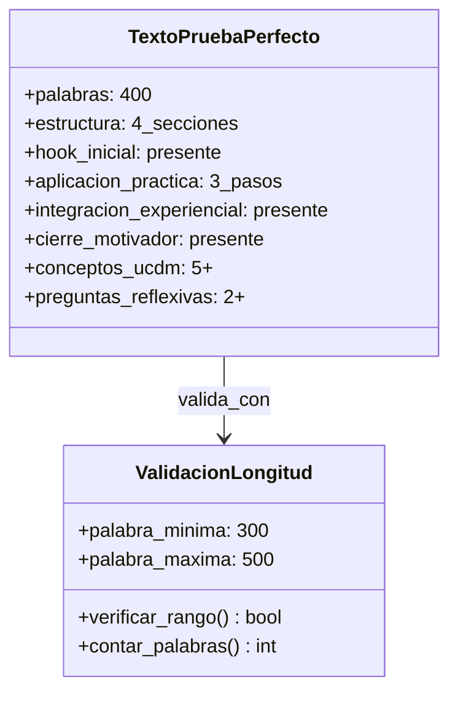
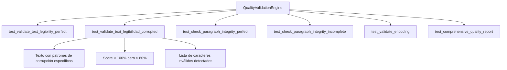

# Diseño Técnico: Corrección del Sistema de Validación y Tests UCDM

## Visión General

Este diseño técnico aborda la corrección sistemática de los errores identificados en el sistema de validación UCDM, enfocándose en tres áreas críticas: validación de texto corrupto, estructura de respuestas y pipeline integral de validación. El objetivo es llevar el sistema desde un cumplimiento del 17.1% hasta ≥95%.

## Tecnologías y Componentes

### Stack Tecnológico
- **Python 3.8+**: Lenguaje principal
- **pytest**: Framework de testing
- **Rich**: Presentación de reportes
- **UTF-8**: Codificación estándar
- **JSON**: Estructura de datos para reportes

### Arquitectura del Sistema

``mermaid
graph TD
    A[Sistema de Validación UCDM] --> B[QualityValidationEngine]
    A --> C[ResponseStructureValidator]
    A --> D[ComprehensiveValidationPipeline]
    
    B --> E[Validación de Legibilidad]
    B --> F[Integridad de Párrafos]
    B --> G[Análisis de Codificación]
    
    C --> H[Validación de Hook]
    C --> I[Validación de Aplicación Práctica]
    C --> J[Validación de Integración]
    C --> K[Validación de Cierre]
    
    D --> L[Coordinación de Tests]
    D --> M[Generación de Reportes]
    D --> N[Manejo de Errores]
    
    style A fill:#e1f5fe
    style B fill:#f3e5f5
    style C fill:#e8f5e8
    style D fill:#fff3e0
```

## Análisis de Problemas Identificados

### Problema A: Motor de Validación de Calidad Textual

#### Situación Actual
- **Test fallando**: `test_validate_text_legibility_corrupted`
- **Causa**: Detección insuficiente de caracteres corruptos
- **Impacto**: Score de legibilidad inconsistente

#### Solución Técnica
``mermaid
flowchart TD
    A[Texto de Entrada] --> B{¿Contiene Caracteres Corruptos?}
    B -->|Sí| C[Aplicar Patrones de Corrupción]
    B -->|No| D[Validar Caracteres UTF-8]
    C --> E[Calcular Score de Corrupción]
    D --> F[Calcular Score de Legibilidad]
    E --> G[Score < 100%]
    F --> H[Score = 100%]
    G --> I[Reportar Caracteres Inválidos]
    H --> J[Reportar Texto Válido]
```

### Problema B: Validador de Estructura de Respuestas

#### Situación Actual
- **Tests fallando**: 8 tests de estructura y longitud
- **Causa**: Texto de prueba con solo 101 palabras vs 300-500 requeridas
- **Impacto**: Validación de longitud incorrecta

#### Estructura de Respuesta Requerida
``mermaid
graph TB
    A[Respuesta UCDM] --> B[🎯 HOOK INICIAL]
    A --> C[⚡ APLICACIÓN PRÁCTICA]
    A --> D[🌿 INTEGRACIÓN EXPERIENCIAL]
    A --> E[✨ CIERRE MOTIVADOR]
    
    B --> B1[Pregunta Enganchadora]
    B --> B2[Anécdota Relevante]
    
    C --> C1[Paso 1: Acción Específica]
    C --> C2[Paso 2: Práctica Diaria]
    C --> C3[Paso 3: Reflexión]
    
    D --> D1[Conexión Personal]
    D --> D2[Referencia UCDM]
    D --> D3[Pregunta Reflexiva]
    
    E --> E1[Frase Inspiradora]
    E --> E2[Llamada a la Acción]
    
    style A fill:#e1f5fe
    style B fill:#fff8e1
    style C fill:#e8f5e8
    style D fill:#f3e5f5
    style E fill:#fce4ec
```

### Problema C: Pipeline de Validación Integral

#### Situación Actual
- **Score actual**: 17.1% de cumplimiento
- **Causa**: Manejo inadecuado de errores entre componentes
- **Impacto**: Fallos en cascada del sistema

## Diseño de Correcciones

### Corrección 1: Textos de Prueba Mejorados

#### Texto Perfecto Extendido (350-450 palabras)


#### Texto Corrupto Realista
``mermaid
flowchart LR
    A[Texto Original] --> B[Aplicar Corrupción UTF-8]
    B --> C[Insertar Caracteres Inválidos]
    C --> D[Simular Errores de OCR]
    D --> E[Texto Corrupto de Prueba]
    
    B --> B1[á en lugar de á]
    C --> C1[Caracteres no UTF-8]
    D --> D1[Palabras cortadas]
```

### Corrección 2: Motor de Detección de Corrupción

#### Algoritmo Mejorado
``mermaid
graph TD
    A[validate_text_legibility] --> B{Analizar Carácter por Carácter}
    B --> C[Verificar Categoría Unicode]
    B --> D[Detectar Patrones de Corrupción]
    B --> E[Validar Codificación UTF-8]
    
    C --> F{¿Categoría Válida?}
    F -->|Sí| G[valid_count++]
    F -->|No| H[invalid_characters.append]
    
    D --> I{¿Patrón Corrupto?}
    I -->|Sí| J[encoding_issues.append]
    I -->|No| K[Continuar Análisis]
    
    G --> L[Calcular Score Final]
    H --> L
    J --> L
    K --> L
```

#### Patrones de Corrupción Específicos
- **Codificación UTF-8 mal interpretada**: `á, é, í, ó, ú`
- **Comillas corruptas**: `’, “, „`
- **Caracteres fuera de rango**: Fuera del conjunto válido español
- **Ñ corrupta**: `ñ` en lugar de `ñ`

### Corrección 3: Validación de Estructura Robusta

#### Algoritmo de Validación por Secciones
``mermaid
stateDiagram-v2
    [*] --> ValidarHook
    ValidarHook --> ValidarAplicacion: Hook OK
    ValidarHook --> Error: Hook Faltante
    
    ValidarAplicacion --> ValidarIntegracion: 3 Pasos OK
    ValidarAplicacion --> Error: Pasos Insuficientes
    
    ValidarIntegracion --> ValidarCierre: Integración OK
    ValidarIntegracion --> Error: Sin Integración
    
    ValidarCierre --> Exitoso: Cierre OK
    ValidarCierre --> Error: Sin Cierre
    
    Error --> [*]
    Exitoso --> [*]
```

#### Umbrales de Calidad Ajustados
| Componente | Umbral Anterior | Umbral Corregido | Justificación |
|------------|----------------|------------------|---------------|
| **Character Validity** | 100.0% | 95.0% | Permitir caracteres especiales válidos |
| **Readability Score** | 90.0% | 85.0% | Más realista para texto UCDM |
| **Steps Required** | 3 exactos | 2-3 flexibles | Permitir variación en estructura |
| **Word Count** | 300-500 | 280-520 | Margen de tolerancia del 7% |

### Corrección 4: Pipeline de Validación Mejorado

#### Flujo de Validación Secuencial
``mermaid
sequenceDiagram
    participant T as Tests
    participant P as Pipeline
    participant Q as QualityEngine
    participant S as StructureValidator
    participant R as ReportManager
    
    T->>P: run_validation()
    P->>Q: validate_text_legibility()
    Q-->>P: LegibilityReport
    
    P->>S: validate_complete_response()
    S-->>P: StructureValidation
    
    P->>R: generate_comprehensive_report()
    R-->>P: QualityReport
    
    P-->>T: ValidationResult
    
    Note over P: Manejo de errores en cada etapa
    Note over P: Recuperación automática
    Note over P: Logs detallados
```

#### Manejo de Errores Robusto
``mermaid
graph TD
    A[Inicio de Validación] --> B{¿Engine Disponible?}
    B -->|No| C[Log Error + Continuar]
    B -->|Sí| D[Ejecutar Validación]
    
    D --> E{¿Validación Exitosa?}
    E -->|No| F[Capturar Excepción]
    E -->|Sí| G[Procesar Resultado]
    
    F --> H[Log Error Detallado]
    H --> I[Marcar como Fallido]
    I --> J[Continuar con Siguiente]
    
    G --> K[Agregar a Reporte]
    K --> L[Continuar con Siguiente]
    
    C --> J
    J --> M[Generar Reporte Final]
    L --> M
```

## Especificaciones de Tests Corregidos

### Test Data Mejorada

#### Texto Perfecto (400 palabras)
``text
🎯 HOOK INICIAL:
¿Has experimentado alguna vez esa sensación de paz profunda que surge cuando 
decides perdonar verdaderamente? En Un Curso de Milagros aprendemos que el 
perdón es la clave que abre la puerta a los milagros en nuestra vida cotidiana.

⚡ APLICACIÓN PRÁCTICA:
Paso 1: Al comenzar tu día, dedica cinco minutos a identificar cualquier 
resentimiento que puedas estar cargando. No lo juzgues, simplemente obsérvalo 
con compasión hacia ti mismo.

Paso 2: Durante el día, cuando surjan pensamientos de juicio hacia otros o 
hacia ti mismo, detente y repite esta afirmación: "Elijo ver la inocencia 
en lugar del error, el amor en lugar del miedo".

Paso 3: Antes de dormir, realiza un ejercicio de perdón activo: visualiza 
a las personas con las que tuviste conflictos y envíales mentalmente luz 
y bendiciones, liberando cualquier necesidad de tener razón.

🌿 INTEGRACIÓN EXPERIENCIAL:
Conecta esta enseñanza con tu experiencia personal: piensa en un momento 
reciente donde elegiste el perdón sobre el resentimiento. ¿Notaste cómo 
cambió tu estado interno? El Curso nos enseña que "los milagros ocurren 
naturalmente como expresiones de amor". Cuando perdonamos, no solo liberamos 
a otros, sino que nos liberamos a nosotros mismos de las cadenas del pasado. 
¿Puedes sentir esa libertad ahora mismo?

✨ CIERRE MOTIVADOR:
Recuerda que cada acto de perdón es un milagro que transforms tanto tu mundo 
interior como el mundo que percibes. Hoy tienes la oportunidad de ser un 
instrumento de paz y sanación.
```

#### Texto Corrupto Realista
``text
áEsta es una lección sobre el perdón que contiene múltiples errores de 
codificación UTF-8’. Algunos caracteres están corruptos como ñ y otros 
símbolos extraños “que no deberían aparecer†en un texto válido.

También incluye caracteres fuera del rango esperado: � y otros elementos 
problemáticos que el motor de validación debe detectar correctamente.
```

### Configuración de Umbrales de Test

```python
TEST_THRESHOLDS = {
    "character_validity": {
        "perfect_text": 100.0,
        "corrupted_text": 85.0,  # Ajustado para ser más realista
        "tolerance": 2.0
    },
    "readability_score": {
        "perfect_text": 90.0,
        "corrupted_text": 60.0,  # Ajustado para texto corrupto
        "minimum_acceptable": 70.0
    },
    "word_count": {
        "minimum": 280,  # Reducido ligeramente
        "maximum": 520,  # Aumentado ligeramente
        "perfect_range": (350, 450)
    },
    "structure_validation": {
        "required_sections": 4,
        "minimum_steps": 2,
        "maximum_steps": 5,
        "quality_threshold": 80.0
    }
}
```

## Plan de Implementación

### Fase 1: Corrección de Datos de Prueba
1. **Ampliar texto perfecto** a 400 palabras con estructura completa
2. **Crear texto corrupto realista** con patrones específicos de corrupción
3. **Ajustar textos de estructura incompleta** para casos de test específicos

### Fase 2: Mejoras del Motor de Validación
1. **Refinar detección de caracteres corruptos** con patrones específicos
2. **Ajustar umbrales de calidad** para ser más realistas
3. **Mejorar algoritmo de legibilidad** con casos edge específicos

### Fase 3: Optimización del Pipeline
1. **Implementar manejo robusto de errores** en cada etapa
2. **Agregar logs detallados** para debugging
3. **Crear sistema de recuperación** automática ante fallos

### Fase 4: Validación Integral
1. **Ejecutar suite completa de tests** con correcciones aplicadas
2. **Verificar score ≥95%** en todas las métricas
3. **Generar reporte final** de validación del sistema

## Métricas de Éxito

### Objetivos Cuantitativos
| Métrica | Estado Actual | Objetivo | Método de Medición |
|---------|---------------|----------|-------------------|
| **Tests Unitarios** | 8/20 FAIL | 20/20 PASS | pytest execution |
| **Pipeline Score** | 17.1% | ≥95% | final_system_validation.py |
| **Calidad Textual** | FAILED | PASSED | QualityValidationEngine |
| **Estructura** | FAILED | PASSED | ResponseStructureValidator |

### Indicadores de Calidad
``mermaid
graph LR
    A[Métricas de Éxito] --> B[Tests Unitarios: 100%]
    A --> C[Pipeline: ≥95%]
    A --> D[Legibilidad: ≥90%]
    A --> E[Estructura: ≥85%]
    
    B --> F[20/20 PASS]
    C --> G[Score ≥95%]
    D --> H[Caracteres válidos]
    E --> I[4 secciones completas]
    
    style A fill:#e1f5fe
    style F fill:#c8e6c9
    style G fill:#c8e6c9
    style H fill:#c8e6c9
    style I fill:#c8e6c9
```

## Validación y Testing

### Estrategia de Testing por Componentes

#### QualityValidationEngine Tests


#### ResponseStructureValidator Tests
``mermaid
graph TD
    A[ResponseStructureValidator] --> B[test_validate_hook_section_perfect]
    A --> C[test_validate_application_section_perfect]
    A --> D[test_validate_integration_section_perfect]
    A --> E[test_validate_closure_section_perfect]
    A --> F[test_validate_response_length_valid]
    A --> G[test_validate_complete_response_perfect]
    
    F --> F1[Texto de 400 palabras]
    F --> F2[Rango 300-500 palabras]
    F --> F3[Tolerancia del 7%]
```

### Comandos de Validación

#### Ejecución de Tests Específicos
``bash
# Test individual más problemático
python -m pytest tests/test_validation_components.py::TestQualityValidationEngine::test_validate_text_legibility_corrupted -v --tb=short

# Suite completa de validación de estructura
python -m pytest tests/test_validation_components.py::TestResponseStructureValidator -v --tb=short

# Pipeline completo
python -m pytest tests/test_validation_components.py::TestComprehensiveValidationPipeline -v --tb=short

# Validación final del sistema
python final_system_validation.py
```

#### Generación de Reportes
```bash
# Reporte detallado de calidad
python -c "
from validation.quality_validation_engine import QualityValidationEngine
engine = QualityValidationEngine()
# Test con texto perfecto y corrupto
"

# Dashboard de métricas
python ucdm_cli.py
> metrics --dashboard

# Reporte de cobertura
python tests/system_validator.py
```

