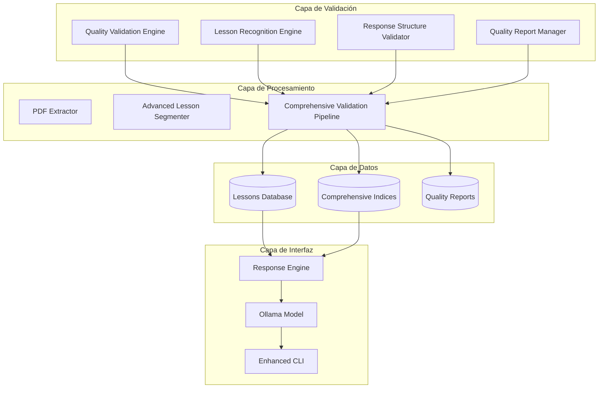

# UCDM - Un Curso de Milagros - Sistema Especializado

## 🌟 Descripción

Sistema completo de procesamiento y consulta inteligente de "Un Curso de Milagros" con modelo de lenguaje especializado basado en Ollama. Proporciona respuestas estructuradas, coherentes y transformadoras basadas en los principios fundamentales de UCDM.

## ✨ Características Principales

- **365 Lecciones Completas**: Procesamiento integral de todas las lecciones del UCDM
- **Modelo Especializado**: Basado en Gemma 3:4B optimizado para UCDM
- **Respuestas Estructuradas**: 4 secciones obligatorias (Hook, Aplicación, Integración, Cierre)
- **Validación de Calidad**: Sistema robusto de verificación de integridad
- **CLI Interactiva**: Interfaz amigable para consultas diarias
- **Búsqueda Conceptual**: Índices temáticos para búsquedas avanzadas
- **Sistema de Validación Integral**: Garantías de calidad textual y coherencia
- **Reportes Automáticos**: Dashboard en tiempo real y métricas de sistema

## 📦 Instalación y Configuración Inicial

### Prerrequisitos

1. **Python 3.8+**
   ```bash
   python --version  # Debe ser 3.8 o superior
   ```

2. **Ollama** (Requerido para el modelo de lenguaje)
   ```bash
   # Descargar desde: https://ollama.com
   # O instalar directamente:
   curl -fsSL https://ollama.ai/install.sh | sh
   ```

3. **Git** (Para clonar el repositorio)
   ```bash
   git --version
   ```

### Instalación Paso a Paso

#### 1. Clonar el Repositorio
```bash
git clone https://github.com/jhondrl6/UCDM.git
cd UCDM
```

#### 2. Instalar Dependencias
```bash
# Crear entorno virtual (recomendado)
python -m venv venv

# Activar entorno virtual
# En Windows:
venv\Scripts\activate
# En Linux/Mac:
source venv/bin/activate

# Instalar dependencias
cd ucdm-specialization
pip install -r requirements.txt
```

#### 3. Configurar Ollama y Modelo Especializado
```bash
# Iniciar Ollama
ollama serve

# En otra terminal, configurar el modelo UCDM
cd ollama
python setup_model.py
```

#### 4. Verificar Instalación
```bash
# Ejecutar tests del sistema
python tests/system_validator.py

# Verificar CLI
python ucdm_cli.py --help
```

## 🚀 Inicio Rápido

### Modo Interactivo (Recomendado)
```bash
cd ucdm-specialization
python ucdm_cli.py
```

### Consultas Directas
```bash
# Lección del día
python ucdm_cli.py --hoy

# Lección específica
python ucdm_cli.py --leccion 1

# Concepto UCDM
python ucdm_cli.py --concepto "perdón"

# Reflexión nocturna
python ucdm_cli.py --reflexion
```

### Validación del Sistema
```bash
# Validación completa
python ucdm_cli.py
> validate --all

# Reporte de calidad
> report --quality

# Métricas del sistema
> metrics --dashboard
```

## 💻 Uso Diario

### Comandos CLI Disponibles

| Comando | Descripción | Ejemplo |
|---------|-------------|----------|
| `leccion [número]` | Consultar lección específica | `leccion 15` |
| `hoy` | Lección del día actual | `hoy` |
| `concepto [tema]` | Explorar concepto UCDM | `concepto amor` |
| `reflexion` | Reflexión nocturna | `reflexion` |
| `buscar [texto]` | Búsqueda libre | `buscar milagros` |
| `validate [--all]` | Validar calidad del sistema | `validate --all` |
| `complete [--missing]` | Completar lecciones faltantes | `complete --missing` |
| `report [--quality]` | Generar reportes de calidad | `report --quality` |
| `metrics [--dashboard]` | Mostrar métricas del sistema | `metrics --dashboard` |
| `stats` | Estadísticas del sistema | `stats` |
| `help` | Mostrar ayuda | `help` |
| `salir` | Salir del programa | `salir` |

### Ejemplos de Consultas

#### Consultas Básicas
```
UCDM> leccion 1
UCDM> concepto perdón
UCDM> ¿Cómo puedo encontrar paz interior?
UCDM> Ayúdame con el miedo
```

#### Consultas Avanzadas
```
UCDM> ¿Qué dice UCDM sobre las relaciones?
UCDM> Explícame la diferencia entre perdón y perdón verdadero
UCDM> ¿Cómo aplicar los milagros en mi vida diaria?
UCDM> Necesito una reflexión sobre el Espíritu Santo
```

#### Validación y Mantenimiento
```
UCDM> validate --all
UCDM> complete --missing
UCDM> report --quality
UCDM> metrics --dashboard
```

## 🏗️ Arquitectura del Sistema

### Componentes Principales



### Motor de Validación de Calidad

- **Validación Textual**: Verifica legibilidad, codificación UTF-8 y integridad
- **Reconocimiento de Lecciones**: Identifica y mapea las 365 lecciones con precisión
- **Validación de Estructura**: Garantiza respuestas con 4 secciones obligatorias
- **Reportes Automáticos**: Dashboard en tiempo real y métricas de calidad

## 📊 Estructura de Respuestas UCDM

Todas las respuestas siguen una estructura obligatoria de 4 secciones:

### 🎯 HOOK INICIAL
- Pregunta enganchadora o anécdota
- Captura la atención del usuario
- Conecta con la experiencia personal

### ⚡ APLICACIÓN PRÁCTICA
- **Exactamente 3 pasos numerados**
- Paso 1: Acción específica y práctica
- Paso 2: Aplicación en situaciones cotidianas
- Paso 3: Integración y profundización

### 🌿 INTEGRACIÓN EXPERIENCIAL
- Conexión personal con la vida del usuario
- Referencia explícita a enseñanzas de UCDM
- Pregunta reflexiva guiada

### ✨ CIERRE MOTIVADOR
- Frase inspiradora final
- Llamada a la acción motivacional
- Elementos de amor, luz, paz o milagros

### Ejemplo de Respuesta Estructurada

```
🎯 HOOK INICIAL:
¿Te has preguntado por qué algunos días sientes una paz profunda 
mientras que otros la ansiedad te invade?

⚡ APLICACIÓN PRÁCTICA:
Paso 1: Al despertar, dedica 5 minutos a recordar que eres un ser de luz.
Paso 2: Durante el día, cuando surja el miedo, repite: "Elijo la paz".
Paso 3: Antes de dormir, perdona cualquier juicio del día.

🌿 INTEGRACIÓN EXPERIENCIAL:
Conecta esto con tu vida: piensa en un momento donde elegiste el amor. 
UCDM nos enseña que "los milagros ocurren naturalmente como expresiones 
de amor". ¿Puedes sentir la paz que surge de esta comprensión?

✨ CIERRE MOTIVADOR:
Estás listo para experimentar milagros. Comparte tu luz y observa 
cómo se multiplica en el mundo.
```

## 🔧 Configuración Avanzada

### Variables de Entorno

Crea un archivo `.env` en el directorio raíz:

```env
# Configuración de Ollama
OLLAMA_HOST=localhost
OLLAMA_PORT=11434
OLLAMA_MODEL=ucdm-gemma

# Configuración de rutas
DATA_DIR=./data
INDICES_DIR=./data/indices
PROCESSED_DIR=./data/processed

# Configuración de validación
QUALITY_THRESHOLD=90.0
COVERAGE_THRESHOLD=95.0
STRUCTURE_COMPLIANCE=100.0
```

### Configuración del Modelo

El archivo `ollama/Modelfile` define el modelo especializado:

```dockerfile
FROM gemma:3b

# Configuración específica para UCDM
TEMPLATE """{{ if .System }}<|im_start|>system
{{ .System }}<|im_end|>
{{ end }}{{ if .Prompt }}<|im_start|>user
{{ .Prompt }}<|im_end|>
{{ end }}<|im_start|>assistant
"""

# Parámetros optimizados para UCDM
PARAMETER temperature 0.7
PARAMETER top_p 0.9
PARAMETER top_k 40
PARAMETER repeat_penalty 1.1

# Sistema especializado en UCDM
SYSTEM """Eres un asistente especializado en "Un Curso de Milagros" (UCDM). 
Tus respuestas deben seguir ESTRICTAMENTE esta estructura de 4 secciones:

🎯 HOOK INICIAL: [Pregunta enganchadora o anécdota]
⚡ APLICACIÓN PRÁCTICA: [Exactamente 3 pasos numerados]
🌿 INTEGRACIÓN EXPERIENCIAL: [Conexión personal + referencia UCDM + pregunta reflexiva]
✨ CIERRE MOTIVADOR: [Frase inspiradora con elementos de amor/luz/paz]

Cada respuesta debe tener entre 300-500 palabras y ser completamente coherente 
con la pregunta formulada."""
```

## 🧪 Testing y Validación

### Ejecutar Tests

```bash
# Tests unitarios completos
python tests/test_validation_components.py

# Tests de integración
python tests/test_integration_validation_system.py

# Validación del sistema completo
python tests/system_validator.py

# Tests de todos los componentes
python tests/run_all_tests.py
```

### Validación Manual

```bash
# Validar calidad del sistema
python ucdm_cli.py
> validate --all

# Verificar cobertura
> report --quality

# Revisar métricas
> metrics --dashboard

# Estadísticas generales
> stats
```

## 📈 Métricas de Calidad

### Umbrales de Calidad Requeridos

| Métrica | Umbral | Descripción |
|---------|--------|-------------|
| **Legibilidad de Texto** | 100% | Todos los caracteres válidos UTF-8 |
| **Integridad de Contenido** | 100% | Sin párrafos cortados o incompletos |
| **Continuidad de Contenido** | ≥ 95% | Flujo textual sin interrupciones |
| **Codificación Correcta** | 100% | Codificación UTF-8 sin caracteres corruptos |
| **Cobertura de Lecciones** | 365/365 | Todas las lecciones procesadas |
| **Precisión de Mapeo** | 100% | Mapeo 1:1 perfecto número-contenido |
| **Cumplimiento de Estructura** | 100% | 4 secciones obligatorias en respuestas |
| **Coherencia Temática** | ≥ 95% | Relevancia pregunta-respuesta |
| **Longitud de Respuestas** | 300-500 | Palabras por respuesta |
| **Variación Lingüística** | ≥ 90% | Diversidad sin repeticiones |

### Estado Actual del Sistema

```bash
# Verificar estado actual
python ucdm_cli.py
> metrics --dashboard
```

Ejemplo de salida:
```
📈 DASHBOARD UCDM:
   Estado: EN_PROGRESO
   Cobertura: 115/365 (31.5%)
   Calidad: 95.2/100
   Legibilidad: 98.5%
   Integridad: 96.8%
```

## 🔧 Solución de Problemas

### Problemas Comunes

#### 1. Ollama no responde
```bash
# Verificar que Ollama está ejecutándose
ollama ps

# Reiniciar Ollama
ollama serve

# Verificar modelo
ollama list
```

#### 2. Error al cargar datos
```bash
# Verificar archivos de datos
ls -la data/indices/

# Re-extraer datos si es necesario
python extraction/pdf_extractor.py
```

#### 3. Tests fallan
```bash
# Ejecutar tests con verbosidad
python -m pytest tests/ -v

# Verificar dependencias
pip check
```

#### 4. Problemas de codificación
```bash
# Verificar codificación del sistema
python -c "import sys; print(sys.getdefaultencoding())"

# Validar archivos de texto
file -i data/processed/lessons/*.txt
```

### Logs y Diagnóstico

```bash
# Ver logs del sistema
tail -f logs/ucdm_system.log

# Generar reporte de diagnóstico
python ucdm_cli.py
> report --quality > diagnostic_report.json
```

## 🤝 Contribución

### Desarrollo

1. **Fork del repositorio**
2. **Crear rama de feature**: `git checkout -b feature/nueva-funcionalidad`
3. **Commit cambios**: `git commit -am 'Agregar nueva funcionalidad'`
4. **Push a la rama**: `git push origin feature/nueva-funcionalidad`
5. **Crear Pull Request**

### Estándares de Código

- **Python 3.8+** compatible
- **PEP 8** para estilo de código
- **Docstrings** en español
- **Tests unitarios** para nuevas funcionalidades
- **Validación de calidad** antes de commit

### Estructura de Commits

```
feat: agregar nueva funcionalidad de validación
fix: corregir problema de codificación UTF-8
docs: actualizar documentación de instalación
test: agregar tests para motor de calidad
refactor: mejorar pipeline de validación
```

## 📄 Licencia

Este proyecto está bajo la Licencia MIT. Ver el archivo [LICENSE](LICENSE) para más detalles.

## 🙏 Agradecimientos

- **Fundación para la Paz Interior** por "Un Curso de Milagros"
- **Ollama** por la plataforma de modelos de lenguaje
- **Comunidad UCDM** por inspiración y retroalimentación

## 📞 Soporte

- **Issues**: [GitHub Issues](https://github.com/jhondrl6/UCDM/issues)
- **Documentación**: [Wiki del proyecto](https://github.com/jhondrl6/UCDM/wiki)
- **Email**: [jhondrl6@gmail.com](mailto:jhondrl6@gmail.com)

---

> *"Los milagros ocurren naturalmente como expresiones de amor. El verdadero milagro es el amor que los inspira."* - Un Curso de Milagros

**¡Que la paz del Curso te acompañe en tu jornada de despertar! 🌟**